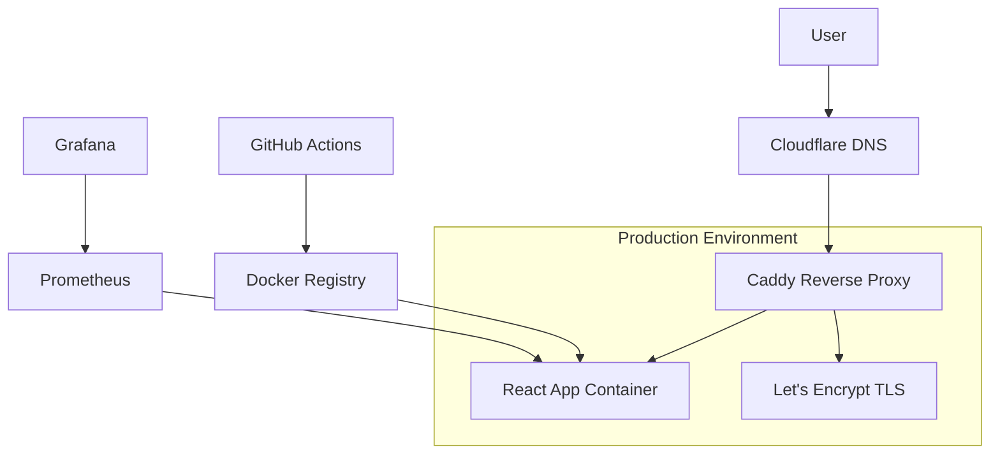

# 🚀 Deployment Guide | Wave → TurboTax Converter

**Production-ready deployment strategies** for the Wave-to-TurboTax React application with automatic TLS, domain configuration, and container orchestration support.

---

## 📋 Table of Contents

1. [🌐 Production Overview](#-production-overview)
2. [🐳 Docker Deployment](#-docker-deployment)
3. [⚙️ Docker Compose Production](#️-docker-compose-production)
4. [☸️ Kubernetes Deployment](#️-kubernetes-deployment)
5. [🔧 Caddy Configuration](#-caddy-configuration)
6. [🌐 Domain Setup](#-domain-setup)
7. [🔒 Security Best Practices](#-security-best-practices)
8. [📊 Monitoring & Logging](#-monitoring--logging)
9. [🔄 CI/CD Pipeline](#-cicd-pipeline)

---

## 🌐 Production Overview

### 🎯 Target Configuration

| Component | Configuration | Details |
|-----------|---------------|---------|
| **Domain** | `tax.yantorno.party` | Primary production domain |
| **TLS Provider** | Let's Encrypt via Caddy | Automatic certificate renewal |
| **Container Runtime** | Docker | Multi-stage production builds |
| **Reverse Proxy** | Caddy 2 | HTTP/3, automatic HTTPS |
| **Orchestration** | Docker Compose / K8s | Scalable deployment options |
| **Monitoring** | Prometheus + Grafana | Metrics and alerting |

### 🏗️ Architecture Diagram



---

## 🐳 Docker Deployment

### 📄 Production Dockerfile

Create `Dockerfile.prod`:

```dockerfile
# ======== BUILD STAGE ========
FROM node:18-alpine AS builder

# Set working directory
WORKDIR /app

# Install build dependencies
COPY package*.json ./
RUN npm ci --only=production

# Copy source code
COPY . .

# Build application
RUN npm run build

# ======== PRODUCTION STAGE ========
FROM nginx:alpine AS production

# Install additional utilities
RUN apk add --no-cache curl

# Copy built application
COPY --from=builder /app/dist /usr/share/nginx/html

# Copy custom nginx config
COPY nginx.conf /etc/nginx/nginx.conf

# Create healthcheck endpoint
RUN echo 'server { listen 80; location /health { return 200 "healthy\\n"; } }' > /etc/nginx/conf.d/health.conf

# Expose port
EXPOSE 80

# Health check
HEALTHCHECK --interval=30s --timeout=3s --start-period=5s --retries=3 \
    CMD curl -f http://localhost/health || exit 1

# Start nginx
CMD ["nginx", "-g", "daemon off;"]
```

### ⚙️ Nginx Configuration

Create `nginx.conf`:

```nginx
events {
    worker_connections 1024;
}

http {
    include /etc/nginx/mime.types;
    default_type application/octet-stream;
    
    # Security headers
    add_header X-Frame-Options "SAMEORIGIN" always;
    add_header X-Content-Type-Options "nosniff" always;
    add_header X-XSS-Protection "1; mode=block" always;
    add_header Referrer-Policy "strict-origin-when-cross-origin" always;
    add_header Content-Security-Policy "default-src 'self'; script-src 'self' 'unsafe-inline'; style-src 'self' 'unsafe-inline'; img-src 'self' data: https:; font-src 'self'; connect-src 'self';" always;
    
    # Gzip compression
    gzip on;
    gzip_vary on;
    gzip_min_length 1024;
    gzip_proxied expired no-cache no-store private must-revalidate auth;
    gzip_types text/plain text/css text/xml text/javascript application/javascript application/xml+rss application/json;
    
    server {
        listen 80;
        server_name localhost;
        root /usr/share/nginx/html;
        index index.html;
        
        # Security
        server_tokens off;
        
        # Static asset caching
        location ~* \.(js|css|png|jpg|jpeg|gif|ico|svg|woff|woff2|ttf|eot)$ {
            expires 1y;
            add_header Cache-Control "public, immutable";
            try_files $uri =404;
        }
        
        # SPA routing
        location / {
            try_files $uri $uri/ /index.html;
            expires -1;
            add_header Cache-Control "no-cache, no-store, must-revalidate";
        }
        
        # Health endpoint
        location /health {
            access_log off;
            return 200 "healthy\n";
        }
    }
}
```

---

## ⚙️ Docker Compose Production

### 📄 Production Compose File

Create `docker-compose.prod.yml`:

```yaml
version: '3.8'

services:
  app:
    build:
      context: .
      dockerfile: Dockerfile.prod
    image: wave-turbotax-app:latest
    container_name: wave-turbotax-app
    restart: unless-stopped
    environment:
      - NODE_ENV=production
      - VITE_APP_VERSION=${APP_VERSION:-2.0.0}
    networks:
      - app-network
    healthcheck:
      test: ["CMD", "curl", "-f", "http://localhost/health"]
      interval: 30s
      timeout: 10s
      retries: 3
      start_period: 40s
    labels:
      - "com.docker.compose.project=wave-turbotax"
      - "traefik.enable=true"
      - "traefik.http.routers.wave-app.rule=Host(`tax.yantorno.party`)"
      - "traefik.http.routers.wave-app.entrypoints=websecure"
      - "traefik.http.routers.wave-app.tls.certresolver=letsencrypt"

  caddy:
    image: caddy:2-alpine
    container_name: wave-turbotax-caddy
    restart: unless-stopped
    ports:
      - "80:80"
      - "443:443"
      - "443:443/udp"  # HTTP/3
    volumes:
      - ./Caddyfile:/etc/caddy/Caddyfile:ro
      - caddy_data:/data
      - caddy_config:/config
    networks:
      - app-network
    environment:
      - CADDY_INGRESS_PORTS=80,443
    healthcheck:
      test: ["CMD", "wget", "--quiet", "--tries=1", "--spider", "http://localhost:2019/config/"]
      interval: 30s
      timeout: 5s
      retries: 3

  prometheus:
    image: prom/prometheus:latest
    container_name: wave-turbotax-prometheus
    restart: unless-stopped
    ports:
      - "9090:9090"
    volumes:
      - ./prometheus.yml:/etc/prometheus/prometheus.yml:ro
      - prometheus_data:/prometheus
    networks:
      - app-network
    command:
      - '--config.file=/etc/prometheus/prometheus.yml'
      - '--storage.tsdb.path=/prometheus'
      - '--web.console.libraries=/etc/prometheus/console_libraries'
      - '--web.console.templates=/etc/prometheus/consoles'
      - '--web.enable-lifecycle'

  grafana:
    image: grafana/grafana:latest
    container_name: wave-turbotax-grafana
    restart: unless-stopped
    ports:
      - "3001:3000"
    volumes:
      - grafana_data:/var/lib/grafana
      - ./grafana/dashboards:/etc/grafana/provisioning/dashboards:ro
      - ./grafana/datasources:/etc/grafana/provisioning/datasources:ro
    networks:
      - app-network
    environment:
      - GF_SECURITY_ADMIN_PASSWORD=${GRAFANA_PASSWORD:-admin123}
      - GF_USERS_ALLOW_SIGN_UP=false

volumes:
  caddy_data:
    driver: local
  caddy_config:
    driver: local
  prometheus_data:
    driver: local
  grafana_data:
    driver: local

networks:
  app-network:
    driver: bridge
    ipam:
      config:
        - subnet: 172.20.0.0/16
```

### 🌍 Environment Variables

Create `.env.prod`:

```bash
# App Configuration
APP_VERSION=2.0.0
NODE_ENV=production

# Grafana Configuration
GRAFANA_PASSWORD=your-secure-password

# Monitoring
PROMETHEUS_RETENTION=30d
```

---

## 🔧 Caddy Configuration

### 📄 Caddyfile

Create `Caddyfile`:

```caddy
{
    # Global options
    admin localhost:2019
    
    # Email for Let's Encrypt
    email admin@yantorno.party
    
    # Local CA for development (comment in production)
    # local_certs
    
    # Log format
    log {
        format console
    }
    
    # Graceful shutdown
    graceful_shutdowns
}

# HTTP to HTTPS redirect
http://tax.yantorno.party {
    redir https://{host}{uri} permanent
}

# Main application
https://tax.yantorno.party {
    # Enable HTTP/3
    bind 0.0.0.0:443
    
    # TLS configuration
    tls {
        protocols tls1.2 tls1.3
        ciphers TLS_ECDHE_ECDSA_WITH_AES_128_GCM_SHA256 TLS_ECDHE_ECDSA_WITH_AES_256_GCM_SHA384
    }
    
    # Security headers
    header {
        # HSTS
        Strict-Transport-Security "max-age=31536000; includeSubDomains; preload"
        
        # Other security headers
        X-Frame-Options "SAMEORIGIN"
        X-Content-Type-Options "nosniff"
        X-XSS-Protection "1; mode=block"
        Referrer-Policy "strict-origin-when-cross-origin"
        Content-Security-Policy "default-src 'self'; script-src 'self' 'unsafe-inline'; style-src 'self' 'unsafe-inline'; img-src 'self' data: https:; font-src 'self'; connect-src 'self';"
        
        # Performance headers
        X-Content-Digest-Nosniff
        Permissions-Policy "geolocation=(), microphone=(), camera=()"
    }
    
    # Reverse proxy to app container
    reverse_proxy app:80 {
        # Health check
        health_uri /health
        health_interval 30s
        health_timeout 5s
        health_status 200
        
        # Connection settings
        transport http {
            dial_timeout 30s
            read_timeout 30s
            write_timeout 30s
        }
        
        # Load balancing (if multiple app instances)
        lb_policy round_robin
        
        # Headers
        header_up X-Forwarded-For {remote_host}
        header_up X-Forwarded-Proto {scheme}
        header_up X-Forwarded-Host {host}
    }
    
    # Static file optimization
    @static {
        path *.js *.css *.png *.jpg *.jpeg *.gif *.ico *.svg *.woff *.woff2 *.ttf *.eot
    }
    handle @static {
        # Cache static files
        header Cache-Control "public, max-age=31536000, immutable"
        header X-Cache-Status "static"
        
        # Compress responses
        encode gzip zstd
        
        reverse_proxy app:80
    }
    
    # SPA route handling
    try_files {path} /index.html
    
    # Logging
    log {
        output file /var/log/caddy/access.log {
            roll_size 100mb
            roll_keep 5
            roll_keep_for 720h
        }
        format json
    }
    
    # Rate limiting
    rate_limit {
        zone static_files
        key {remote_host}
        events 100
        window 1m
    }
}

# Monitoring endpoints (internal only)
:2019 {
    bind 127.0.0.1:2019
    
    # Basic auth for admin interface
    basicauth {
        admin $2a$14$YourHashedPasswordHere
    }
}

# Optional: Staging environment
# https://staging.tax.yantorno.party {
#     reverse_proxy app:80
# }
```

---

## 🌐 Domain Setup

### 🌍 DNS Configuration

Configure your DNS provider (Cloudflare recommended):

| Record | Type | Value | TTL |
|--------|------|-------|-----|
| tax.yantorno.party | A | YOUR_SERVER_IP | 300 |
| tax.yantorno.party | AAAA | YOUR_IPV6_ADDRESS | 300 |
| www.tax.yantorno.party | CNAME | tax.yantorno.party | 300 |

### 🔒 SSL/TLS Setup

#### **Let's Encrypt via Caddy** (Recommended)
- **Automatic**: Handled by Caddy configuration
- **Renewal**: Automatic 30 days before expiry
- **HTTP-01 Challenge**: Port 80 accessibility required
- **DNS-01 Challenge**: Available if port 80 blocked

#### **Manual Certificate** (Alternative)
```bash
# Generate certificate with Certbot
certbot certonly --standalone -d tax.yantorno.party

# Copy certificates to Caddy
cp /etc/letsencrypt/live/tax.yantorno.party/fullchain.pem /etc/caddy/certs/
cp /etc/letsencrypt/live/tax.yantorno.party/privkey.pem /etc/caddy/certs/
```

### 🚀 Deployment Commands

#### **Step 1: Environment Setup**
```bash
# Clone repository
git clone https://github.com/tupacalypse187/wave-turbotax-import.git
cd wave-turbotax-import

# Create environment file
cp .env.example .env.prod
# Edit .env.prod with your values
```

#### **Step 2: Build and Deploy**
```bash
# Pull latest code
git pull origin main

# Build and start services
docker-compose -f docker-compose.prod.yml --env-file .env.prod up -d --build

# Check logs
docker-compose -f docker-compose.prod.yml logs -f app caddy
```

#### **Step 3: Verify Deployment**
```bash
# Check service health
curl -f https://tax.yantorno.party/health

# Check SSL certificate
curl -I https://tax.yantorno.party

# Check container status
docker-compose -f docker-compose.prod.yml ps
```

---

## 🔒 Security Best Practices

### 🛡️ Network Security

#### **Firewall Configuration**
```bash
# UFW rules
ufw allow 80/tcp    # HTTP
ufw allow 443/tcp   # HTTPS
ufw allow 443/udp   # HTTP/3
ufw deny 2019/tcp   # Caddy admin (internal only)
ufw deny 3000/tcp   # Direct app access blocked
ufw deny 8080/tcp   # Admin interfaces blocked
ufw enable
```

#### **Fail2ban Configuration**
```bash
# /etc/fail2ban/jail.local
[caddy-auth]
enabled = true
filter = caddy-auth
port = 80,443
maxretry = 5
bantime = 3600
findtime = 600

[caddy-noscript]
enabled = true
filter = caddy-noscript
port = 80,443
maxretry = 3
bantime = 7200
findtime = 300
```

### 🔐 Application Security

#### **Content Security Policy**
```nginx
add_header Content-Security-Policy "
    default-src 'self';
    script-src 'self' 'unsafe-inline';
    style-src 'self' 'unsafe-inline';
    img-src 'self' data: https:;
    font-src 'self';
    connect-src 'self';
    frame-ancestors 'none';
    base-uri 'self';
    form-action 'self';
" always;
```

#### **Security Headers**
```nginx
# Advanced security headers
add_header X-Frame-Options "SAMEORIGIN" always;
add_header X-Content-Type-Options "nosniff" always;
add_header X-XSS-Protection "1; mode=block" always;
add_header Referrer-Policy "strict-origin-when-cross-origin" always;
add_header Permissions-Policy "geolocation=(), microphone=(), camera=(), payment=()" always;
```

### 🔑 Secrets Management

#### **Docker Secrets**
```yaml
# docker-compose.prod.yml
services:
  app:
    secrets:
      - app_version
      - grafana_password

secrets:
  app_version:
    file: ./secrets/app_version.txt
  grafana_password:
    file: ./secrets/grafana_password.txt
```

---

## 📊 Monitoring & Logging

### 📈 Prometheus Configuration

Create `prometheus.yml`:

```yaml
global:
  scrape_interval: 15s
  evaluation_interval: 15s

rule_files:
  - "rules/*.yml"

alerting:
  alertmanagers:
    - static_configs:
        - targets:
          - alertmanager:9093

scrape_configs:
  - job_name: 'caddy'
    static_configs:
      - targets: ['caddy:2019']
    metrics_path: /metrics
    scrape_interval: 30s

  - job_name: 'app'
    static_configs:
      - targets: ['app:80']
    metrics_path: /health
    scrape_interval: 30s

  - job_name: 'node'
    static_configs:
      - targets: ['node-exporter:9100']
    scrape_interval: 30s
```

### 📋 Grafana Dashboards

#### **Docker Dashboard**
- Container resource usage
- Network traffic
- Storage I/O

#### **Caddy Dashboard**
- Request rates
- Response times
- SSL certificate expiry
- HTTP status codes

#### **Application Metrics**
- Health check status
- Custom business metrics
- Error rates

### 📝 Log Management

#### **Log Rotation**
```bash
# /etc/logrotate.d/caddy
/var/log/caddy/*.log {
    daily
    missingok
    rotate 30
    compress
    delaycompress
    notifempty
    create 644 caddy caddy
    postrotate
        docker kill -s USR1 caddy
    endscript
}
```

#### **Centralized Logging**
```yaml
# docker-compose.prod.yml (add)
  loki:
    image: grafana/loki:latest
    container_name: wave-turbotax-loki
    restart: unless-stopped
    ports:
      - "3100:3100"
    volumes:
      - ./loki.yml:/etc/loki/local-config.yaml:ro
      - loki_data:/loki
    networks:
      - app-network

  promtail:
    image: grafana/promtail:latest
    container_name: wave-turbotax-promtail
    restart: unless-stopped
    volumes:
      - /var/log:/var/log:ro
      - /var/lib/docker/containers:/var/lib/docker/containers:ro
      - ./promtail.yml:/etc/promtail/config.yml:ro
    networks:
      - app-network
```

---

## 🔄 CI/CD Pipeline

### 🚀 GitHub Actions Workflow

Create `.github/workflows/deploy.yml`:

```yaml
name: Deploy to Production

on:
  push:
    branches: [main]
  workflow_dispatch:

env:
  REGISTRY: ghcr.io
  IMAGE_NAME: wave-turbotax-app

jobs:
  test:
    runs-on: ubuntu-latest
    steps:
      - name: Checkout code
        uses: actions/checkout@v4

      - name: Setup Node.js
        uses: actions/setup-node@v4
        with:
          node-version: '18'
          cache: 'npm'

      - name: Install dependencies
        run: npm ci

      - name: Run tests
        run: npm run test:ci

      - name: Run linting
        run: npm run lint

      - name: Type checking
        run: npm run typecheck

  build-and-deploy:
    needs: test
    runs-on: ubuntu-latest
    if: github.ref == 'refs/heads/main'
    
    steps:
      - name: Checkout code
        uses: actions/checkout@v4

      - name: Set up Docker Buildx
        uses: docker/setup-buildx-action@v3

      - name: Log in to Container Registry
        uses: docker/login-action@v3
        with:
          registry: ${{ env.REGISTRY }}
          username: ${{ github.actor }}
          password: ${{ secrets.GITHUB_TOKEN }}

      - name: Extract metadata
        id: meta
        uses: docker/metadata-action@v5
        with:
          images: ${{ env.REGISTRY }}/${{ env.IMAGE_NAME }}
          tags: |
            type=ref,event=branch
            type=ref,event=pr
            type=semver,pattern={{version}}
            type=semver,pattern={{major}}.{{minor}}
            type=sha,prefix={{branch}}-

      - name: Build and push Docker image
        uses: docker/build-push-action@v5
        with:
          context: .
          file: ./Dockerfile.prod
          push: true
          tags: ${{ steps.meta.outputs.tags }}
          labels: ${{ steps.meta.outputs.labels }}
          cache-from: type=gha
          cache-to: type=gha,mode=max

      - name: Deploy to production
        uses: appleboy/ssh-action@v1.0.3
        with:
          host: ${{ secrets.PROD_HOST }}
          username: ${{ secrets.PROD_USER }}
          key: ${{ secrets.PROD_SSH_KEY }}
          script: |
            cd /opt/wave-turbotax
            docker-compose -f docker-compose.prod.yml pull
            docker-compose -f docker-compose.prod.yml up -d
            docker system prune -f

      - name: Health check
        run: |
          sleep 30
          curl -f https://tax.yantorno.party/health

  notify:
    needs: [test, build-and-deploy]
    runs-on: ubuntu-latest
    if: always()
    
    steps:
      - name: Notify on success
        if: needs.build-and-deploy.result == 'success'
        run: |
          curl -X POST "https://api.telegram.org/bot${{ secrets.TELEGRAM_BOT_TOKEN }}/sendMessage" \
          -H "Content-Type: application/json" \
          -d '{
            "chat_id": "${{ secrets.TELEGRAM_CHAT_ID }}",
            "text": "✅ Wave TurboTax deployed successfully to https://tax.yantorno.party"
          }'

      - name: Notify on failure
        if: needs.test.result == 'failure' || needs.build-and-deploy.result == 'failure'
        run: |
          curl -X POST "https://api.telegram.org/bot${{ secrets.TELEGRAM_BOT_TOKEN }}/sendMessage" \
          -H "Content-Type: application/json" \
          -d '{
            "chat_id": "${{ secrets.TELEGRAM_CHAT_ID }}",
            "text": "❌ Wave TurboTax deployment failed!"
          }'
```

### 🔧 Secrets Configuration

Add these to GitHub repository secrets:

| Secret | Description |
|--------|-------------|
| `PROD_HOST` | Production server IP/hostname |
| `PROD_USER` | SSH username for server |
| `PROD_SSH_KEY` | Private SSH key (base64 encoded) |
| `TELEGRAM_BOT_TOKEN` | Bot token for notifications |
| `TELEGRAM_CHAT_ID` | Chat ID for notifications |

---

## 📋 Deployment Checklist

### ✅ Pre-Deployment

- [ ] Domain DNS configured (`tax.yantorno.party`)
- [ ] SSL certificates ready (Let's Encrypt)
- [ ] Firewall rules applied (80, 443)
- [ ] Server resources provisioned
- [ ] Environment variables configured
- [ ] Secrets management setup

### 🚀 Deployment Steps

1. **Clone and setup**
   ```bash
   git clone https://github.com/tupacalypse187/wave-turbotax-import.git
   cd wave-turbotax-import
   ```

2. **Configure environment**
   ```bash
   cp .env.example .env.prod
   # Edit .env.prod with production values
   ```

3. **Build and start**
   ```bash
   docker-compose -f docker-compose.prod.yml --env-file .env.prod up -d --build
   ```

4. **Verify deployment**
   ```bash
   curl -f https://tax.yantorno.party/health
   ```

### ✅ Post-Deployment

- [ ] Health checks passing
- [ ] SSL certificate valid
- [ ] Monitoring configured
- [ ] Backup procedures tested
- [ ] Documentation updated
- [ ] Team notified

---

## 🆘 Troubleshooting

### 🔧 Common Issues

| Issue | Solution |
|-------|----------|
| **SSL certificate not renewing** | Check Let's Encrypt rate limits, verify port 80 access |
| **Container won't start** | Check docker-compose logs, verify image build |
| **High memory usage** | Optimize Dockerfile, add resource limits |
| **502 Bad Gateway** | Check upstream app health, verify reverse proxy config |
| **CORS errors** | Update security headers, check CSP policy |

### 📞 Support

- **Logs**: `docker-compose logs -f app caddy`
- **Health**: `curl https://tax.yantorno.party/health`
- **Metrics**: `http://your-server:9090` (Prometheus)
- **Dashboard**: `http://your-server:3001` (Grafana)

---

<div align="center">
  <p>🚀 Your Wave-to-TurboTax converter is now production-ready!</p>
  <p>🌐 Deployed at: <a href="https://tax.yantorno.party">https://tax.yantorno.party</a></p>
  <p>📊 Monitoring: <a href="https://tax.yantorno.party:3001">Grafana Dashboard</a></p>
</div>