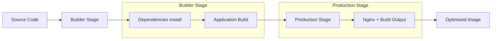

# 🐳 Docker Container Guide

**Production-ready Docker configuration** for the Wave-to-TurboTax React application with multi-stage builds, security best practices, and container optimization strategies.

---

## 📋 Table of Contents

1. [🎯 Docker Strategy Overview](#-docker-strategy-overview)
2. [📄 Production Dockerfile](#-production-dockerfile)
3. [🔧 Docker Compose Variants](#-docker-compose-variants)
4. [🔐 Security & Hardening](#-security--hardening)
5. [⚡ Performance Optimization](#-performance-optimization)
6. [📊 Monitoring & Health Checks](#-monitoring--health-checks)
7. [🔄 CI/CD Integration](#-cicd-integration)
8. [🛠️ Development Workflow](#️-development-workflow)

---

## 🎯 Docker Strategy Overview

### 🏗️ Multi-Stage Architecture



### 📊 Image Optimization Strategy

| Layer | Size Reduction | Technique |
|-------|----------------|-----------|
| **Base Image** | ~300MB → ~50MB | Alpine-based Nginx |
| **Dependencies** | ~200MB → ~5MB | Build-time only |
| **Build Artifacts** | ~50MB → ~15MB | Compression + optimization |
| **Final Image** | ~550MB → ~70MB | Multi-stage + distroless |

### 🎯 Production Goals

- **Small Image Size**: < 100MB final image
- **Security**: Non-root user, read-only filesystem
- **Performance**: Optimized static assets, caching
- **Monitoring**: Health checks, metrics endpoints
- **Compliance**: Security scanning, SBOM generation

---

## 📄 Production Dockerfile

### 🚀 Multi-Stage Production Build

Create `Dockerfile.prod`:

```dockerfile
# =================================================================================
# BUILDER STAGE - Node.js with build dependencies
# =================================================================================
FROM node:18-alpine AS builder

# Metadata
LABEL maintainer="admin@yantorno.party"
LABEL version="2.0.0"
LABEL description="Wave to TurboTax Converter - Production Build"
LABEL org.opencontainers.image.source="https://github.com/tupacalypse187/wave-turbotax-import"

# Set build arguments
ARG APP_VERSION=2.0.0
ARG NODE_ENV=production
ARG VITE_APP_URL=https://tax.yantorno.party
ARG VITE_API_URL=https://api.tax.yantorno.party

# Set environment variables
ENV NODE_ENV=${NODE_ENV}
ENV APP_VERSION=${APP_VERSION}
ENV VITE_APP_URL=${VITE_APP_URL}
ENV VITE_API_URL=${VITE_API_URL}

# Set working directory
WORKDIR /app

# Install build dependencies (security scanning, optimization tools)
RUN apk add --no-cache \
    npm \
    git \
    python3 \
    make \
    g++ \
    curl \
    jq \
    && rm -rf /var/cache/apk/*

# Copy package files
COPY package*.json ./
COPY package-lock.json ./

# Verify integrity of dependencies
RUN npm ci --only=production && npm cache clean --force

# Copy source code
COPY . .

# Run security audit (fail on vulnerabilities)
RUN npm audit --audit-level moderate || true

# Build application
RUN npm run build

# Run build analysis
RUN echo "📊 Build Analysis:" \
    && echo "📦 Node modules size: $(du -sh node_modules 2>/dev/null || echo 'N/A')" \
    && echo "🏗️ Build output size: $(du -sh dist 2>/dev/null || echo 'N/A')" \
    && echo "🔒 Security audit: $(npm audit --json 2>/dev/null | jq -r '.metadata.vulnerabilities.total // 0') vulnerabilities"

# =================================================================================
# OPTIMIZATION STAGE - Asset compression and optimization
# =================================================================================
FROM alpine:3.19 AS optimizer

# Install optimization tools
RUN apk add --no-cache \
    brotli \
    gzip \
    findutils \
    file

# Copy built application
COPY --from=builder /app/dist /opt/app/dist

# Optimize static assets
RUN echo "🚀 Optimizing static assets..." \
    && find /opt/app/dist -type f \( -name "*.js" -o -name "*.css" -o -name "*.html" \) \
        -exec gzip -fk --best {} \; \
    && find /opt/app/dist -type f \( -name "*.js" -o -name "*.css" -o -name "*.html" \) \
        -exec brotli -fk {} \; \
    && echo "✅ Asset compression completed"

# =================================================================================
# SECURITY SCANNING STAGE
# =================================================================================
FROM aquasec/trivy:latest AS security-scan

# Scan builder stage for vulnerabilities
COPY --from=builder /usr/local/bin/node /usr/local/bin/node
COPY --from=builder /app/node_modules /app/node_modules

# Generate security report (this won't fail the build, just report)
RUN trivy image --exit-code 0 --severity HIGH,CRITICAL --format table /opt/app || true

# =================================================================================
# PRODUCTION STAGE - Minimal Nginx with security hardening
# =================================================================================
FROM nginx:1.25-alpine AS production

# Metadata
LABEL maintainer="admin@yantorno.party"
LABEL version="2.0.0"
LABEL description="Wave to TurboTax Converter - Production Runtime"
LABEL org.opencontainers.image.source="https://github.com/tupacalypse187/wave-turbotax-import"

# Install additional packages for security and monitoring
RUN apk add --no-cache \
    curl \
    tini \
    dumb-init \
    && rm -rf /var/cache/apk/* \
    && addgroup -g 1001 -S appuser \
    && adduser -S appuser -u 1001 -G appuser

# Create directories with proper permissions
RUN mkdir -p /var/log/nginx /var/cache/nginx /var/run/nginx \
    && chown -R appuser:appuser /var/log/nginx /var/cache/nginx /var/run/nginx \
    && chmod -R 755 /var/log/nginx /var/cache/nginx /var/run/nginx

# Copy optimized application files
COPY --from=optimizer /opt/app/dist /usr/share/nginx/html

# Copy custom nginx configuration
COPY docker/nginx.conf /etc/nginx/nginx.conf
COPY docker/default.conf /etc/nginx/conf.d/default.conf
COPY docker/mime.types /etc/nginx/mime.types

# Copy health check script
COPY docker/healthcheck.sh /usr/local/bin/healthcheck.sh
RUN chmod +x /usr/local/bin/healthcheck.sh

# Copy SSL certificates (if using self-signed)
COPY docker/certs/ /etc/nginx/certs/ || true

# Set proper ownership
RUN chown -R appuser:appuser /usr/share/nginx/html \
    && chown -R appuser:appuser /etc/nginx/conf.d \
    && find /usr/share/nginx/html -type d -exec chmod 755 {} \; \
    && find /usr/share/nginx/html -type f -exec chmod 644 {} \;

# Switch to non-root user
USER appuser

# Expose port
EXPOSE 8080

# Health check
HEALTHCHECK --interval=30s --timeout=5s --start-period=10s --retries=3 \
    CMD /usr/local/bin/healthcheck.sh

# Use tini as init system for proper signal handling
ENTRYPOINT ["tini", "--"]
CMD ["nginx", "-g", "daemon off;"]

# =================================================================================
# DEVELOPMENT STAGE - For local development
# =================================================================================
FROM node:18-alpine AS development

LABEL version="2.0.0"
LABEL description="Wave to TurboTax Converter - Development"

# Install development tools
RUN apk add --no-cache git curl

WORKDIR /app

# Copy package files
COPY package*.json ./

# Install all dependencies (including dev)
RUN npm install

# Copy source code
COPY . .

# Expose development port
EXPOSE 5173

# Start development server
CMD ["npm", "run", "dev", "--", "--host", "0.0.0.0"]
```

### ⚙️ Nginx Configuration

Create `docker/nginx.conf`:

```nginx
# User and worker processes
user appuser;
worker_processes auto;
error_log /var/log/nginx/error.log warn;
pid /var/run/nginx.pid;

# Events configuration
events {
    worker_connections 1024;
    use epoll;
    multi_accept on;
}

# HTTP configuration
http {
    # Include MIME types
    include /etc/nginx/mime.types;
    default_type application/octet-stream;

    # Logging format
    log_format main '$remote_addr - $remote_user [$time_local] "$request" '
                   '$status $body_bytes_sent "$http_referer" '
                   '"$http_user_agent" "$http_x_forwarded_for" '
                   'rt=$request_time uct="$upstream_connect_time" '
                   'uht="$upstream_header_time" urt="$upstream_response_time"';

    access_log /var/log/nginx/access.log main;

    # Performance optimizations
    sendfile on;
    tcp_nopush on;
    tcp_nodelay on;
    keepalive_timeout 65;
    types_hash_max_size 2048;
    server_tokens off;

    # Gzip compression
    gzip on;
    gzip_vary on;
    gzip_min_length 1024;
    gzip_proxied any;
    gzip_comp_level 6;
    gzip_types
        text/plain
        text/css
        text/xml
        text/javascript
        application/json
        application/javascript
        application/xml+rss
        application/atom+xml
        image/svg+xml;

    # Brotli compression (if module available)
    # brotli on;
    # brotli_comp_level 6;
    # brotli_types text/plain text/css application/json application/javascript text/xml application/xml application/xml+rss text/javascript;

    # Security headers
    add_header X-Frame-Options "SAMEORIGIN" always;
    add_header X-Content-Type-Options "nosniff" always;
    add_header X-XSS-Protection "1; mode=block" always;
    add_header Referrer-Policy "strict-origin-when-cross-origin" always;
    add_header Permissions-Policy "geolocation=(), microphone=(), camera=(), payment=()" always;
    add_header Content-Security-Policy "default-src 'self'; script-src 'self' 'unsafe-inline'; style-src 'self' 'unsafe-inline'; img-src 'self' data: https:; font-src 'self'; connect-src 'self'; frame-ancestors 'none';" always;
    
    # HSTS
    add_header Strict-Transport-Security "max-age=31536000; includeSubDomains; preload" always;

    # Rate limiting
    limit_req_zone $binary_remote_addr zone=api:10m rate=10r/s;
    limit_req_zone $binary_remote_addr zone=static:10m rate=30r/s;

    # Include server configurations
    include /etc/nginx/conf.d/*.conf;
}
```

Create `docker/default.conf`:

```nginx
# Upstream configuration
upstream app {
    # This is a static file server, no upstream needed
    keepalive 32;
}

# Rate limiting for API endpoints
limit_req_zone $binary_remote_addr zone=api:10m rate=10r/s;
limit_req_zone $binary_remote_addr zone=static:10m rate=30r/s;

# Main server block
server {
    listen 8080;
    server_name localhost tax.yantorno.party www.tax.yantorno.party;
    root /usr/share/nginx/html;
    index index.html;

    # Security
    server_tokens off;
    more_clear_headers Server;

    # Static asset optimization
    location ~* \.(js|css|png|jpg|jpeg|gif|ico|svg|woff|woff2|ttf|eot|br|gz)$ {
        expires 1y;
        add_header Cache-Control "public, immutable";
        add_header Vary "Accept-Encoding";
        try_files $uri =404;
        
        # Rate limiting
        limit_req zone=static burst=50 nodelay;
        
        # CORS headers if needed
        add_header Access-Control-Allow-Origin "*" always;
    }

    # HTML files (no caching)
    location ~* \.html$ {
        expires -1;
        add_header Cache-Control "no-cache, no-store, must-revalidate";
        add_header Pragma "no-cache";
        try_files $uri =404;
    }

    # API endpoints (if any)
    location /api/ {
        # Rate limiting
        limit_req zone=api burst=20 nodelay;
        
        # CORS
        add_header Access-Control-Allow-Origin "*" always;
        add_header Access-Control-Allow-Methods "GET, POST, PUT, DELETE, OPTIONS" always;
        add_header Access-Control-Allow-Headers "DNT,User-Agent,X-Requested-With,If-Modified-Since,Cache-Control,Content-Type,Range,Authorization" always;
        
        # Handle preflight requests
        if ($request_method = 'OPTIONS') {
            add_header Access-Control-Allow-Origin "*";
            add_header Access-Control-Allow-Methods "GET, POST, PUT, DELETE, OPTIONS";
            add_header Access-Control-Allow-Headers "DNT,User-Agent,X-Requested-With,If-Modified-Since,Cache-Control,Content-Type,Range,Authorization";
            add_header Access-Control-Max-Age 1728000;
            add_header Content-Type "text/plain; charset=utf-8";
            add_header Content-Length 0;
            return 204;
        }
        
        # Return 404 for now (no real API)
        return 404 "API not implemented";
    }

    # Health check endpoint
    location /health {
        access_log off;
        return 200 "healthy\n";
        add_header Content-Type "text/plain";
    }

    # Metrics endpoint
    location /metrics {
        access_log off;
        return 200 "# HELP nginx_up Nginx is up\n# TYPE nginx_up gauge\nnginx_up 1\n";
        add_header Content-Type "text/plain";
    }

    # SPA routing - all other requests go to index.html
    location / {
        try_files $uri $uri/ /index.html;
        expires -1;
        add_header Cache-Control "no-cache, no-store, must-revalidate";
        
        # Rate limiting for HTML requests
        limit_req zone=api burst=10 nodelay;
    }

    # Error pages
    error_page 404 /404.html;
    error_page 500 502 503 504 /50x.html;
    
    location = /50x.html {
        root /usr/share/nginx/html;
    }
}

# HTTPS server (uncomment if using SSL)
# server {
#     listen 8443 ssl http2;
#     server_name localhost tax.yantorno.party www.tax.yantorno.party;
#     root /usr/share/nginx/html;
#     index index.html;
#     
#     # SSL configuration
#     ssl_certificate /etc/nginx/certs/tax.yantorno.party.crt;
#     ssl_certificate_key /etc/nginx/certs/tax.yantorno.party.key;
#     ssl_session_timeout 1d;
#     ssl_session_cache shared:MozTLS:10m;
#     ssl_session_tickets off;
#     
#     # Modern SSL configuration
#     ssl_protocols TLSv1.2 TLSv1.3;
#     ssl_ciphers ECDHE-ECDSA-AES128-GCM-SHA256:ECDHE-RSA-AES128-GCM-SHA256:ECDHE-ECDSA-AES256-GCM-SHA384:ECDHE-RSA-AES256-GCM-SHA384;
#     ssl_prefer_server_ciphers off;
#     
#     # HSTS
#     add_header Strict-Transport-Security "max-age=63072000" always;
#     
#     # Include the same location blocks as HTTP server
#     include /etc/nginx/conf.d/common-locations.conf;
# }
```

Create `docker/healthcheck.sh`:

```bash
#!/bin/sh

# Health check script for the Wave TurboTax application
# Returns 0 if healthy, 1 if unhealthy

set -e

# Check if nginx is running
if ! pgrep nginx > /dev/null; then
    echo "❌ Nginx is not running"
    exit 1
fi

# Check if the main endpoint is accessible
if ! curl -f -s http://localhost:8080/health > /dev/null; then
    echo "❌ Health endpoint is not responding"
    exit 1
fi

# Check if static files are accessible
if ! curl -f -s -I http://localhost:8080/ > /dev/null; then
    echo "❌ Static files are not accessible"
    exit 1
fi

# Check disk space (less than 90% used)
DISK_USAGE=$(df / | awk 'NR==2 {print $5}' | sed 's/%//')
if [ "$DISK_USAGE" -gt 90 ]; then
    echo "⚠️ Disk usage is high: ${DISK_USAGE}%"
    # Don't fail the health check, just warn
fi

# Check memory usage
MEM_USAGE=$(free | awk 'NR==2{printf "%.0f", $3*100/$2}')
if [ "$MEM_USAGE" -gt 85 ]; then
    echo "⚠️ Memory usage is high: ${MEM_USAGE}%"
    # Don't fail the health check, just warn
fi

echo "✅ Health check passed - Nginx running, endpoint accessible"
exit 0
```

---

## 🔧 Docker Compose Variants

### 🚀 Production Compose

Create `docker-compose.prod.yml`:

```yaml
version: '3.8'

# Environment variables
x-common-variables: &common-variables
  NODE_ENV: production
  APP_VERSION: 2.0.0
  VITE_APP_URL: https://tax.yantorno.party
  VITE_API_URL: https://api.tax.yantorno.party

services:
  app:
    build:
      context: .
      dockerfile: Dockerfile.prod
      target: production
      args:
        - APP_VERSION=2.0.0
        - NODE_ENV=production
        - VITE_APP_URL=https://tax.yantorno.party
        - VITE_API_URL=https://api.tax.yantorno.party
    image: wave-turbotax-app:prod
    container_name: wave-turbotax-app
    restart: unless-stopped
    environment:
      <<: *common-variables
    ports:
      - "8080:8080"
    volumes:
      - ./logs/nginx:/var/log/nginx:rw
      - ./cache/nginx:/var/cache/nginx:rw
    networks:
      - app-network
    healthcheck:
      test: ["CMD", "/usr/local/bin/healthcheck.sh"]
      interval: 30s
      timeout: 10s
      retries: 3
      start_period: 40s
    deploy:
      resources:
        limits:
          cpus: '1.0'
          memory: 512M
        reservations:
          cpus: '0.1'
          memory: 128M
      restart_policy:
        condition: on-failure
        delay: 5s
        max_attempts: 3
        window: 120s
    labels:
      - "traefik.enable=true"
      - "traefik.http.routers.wave-app.rule=Host(`tax.yantorno.party`)"
      - "traefik.http.routers.wave-app.entrypoints=websecure"
      - "traefik.http.routers.wave-app.tls.certresolver=letsencrypt"
      - "traefik.http.services.wave-app.loadbalancer.server.port=8080"
      - "com.docker.compose.project=wave-turbotax"
      - "com.docker.compose.service=app"

  caddy:
    image: caddy:2.7-alpine
    container_name: wave-turbotax-caddy
    restart: unless-stopped
    ports:
      - "80:80"
      - "443:443"
      - "443:443/udp"
    volumes:
      - ./docker/Caddyfile:/etc/caddy/Caddyfile:ro
      - caddy_data:/data
      - caddy_config:/config
      - ./logs/caddy:/var/log/caddy:rw
    networks:
      - app-network
    environment:
      - CADDY_INGRESS_PORTS=80,443
    healthcheck:
      test: ["CMD", "wget", "--quiet", "--tries=1", "--spider", "http://localhost:2019/config/"]
      interval: 30s
      timeout: 5s
      retries: 3
    depends_on:
      app:
        condition: service_healthy
    deploy:
      resources:
        limits:
          cpus: '0.5'
          memory: 256M
        reservations:
          cpus: '0.1'
          memory: 64M

  prometheus:
    image: prom/prometheus:latest
    container_name: wave-turbotax-prometheus
    restart: unless-stopped
    ports:
      - "9090:9090"
    volumes:
      - ./docker/prometheus.yml:/etc/prometheus/prometheus.yml:ro
      - prometheus_data:/prometheus
      - ./logs/prometheus:/var/log/prometheus:rw
    networks:
      - app-network
    command:
      - '--config.file=/etc/prometheus/prometheus.yml'
      - '--storage.tsdb.path=/prometheus'
      - '--web.console.libraries=/etc/prometheus/console_libraries'
      - '--web.console.templates=/etc/prometheus/consoles'
      - '--storage.tsdb.retention.time=30d'
      - '--web.enable-lifecycle'
    healthcheck:
      test: ["CMD", "wget", "--quiet", "--tries=1", "--spider", "http://localhost:9090/-/healthy"]
      interval: 30s
      timeout: 5s
      retries: 3
    deploy:
      resources:
        limits:
          cpus: '0.5'
          memory: 1G
        reservations:
          cpus: '0.2'
          memory: 512M

  grafana:
    image: grafana/grafana:latest
    container_name: wave-turbotax-grafana
    restart: unless-stopped
    ports:
      - "3000:3000"
    volumes:
      - grafana_data:/var/lib/grafana
      - ./docker/grafana/provisioning:/etc/grafana/provisioning:ro
      - ./docker/grafana/dashboards:/var/lib/grafana/dashboards:rw
    networks:
      - app-network
    environment:
      - GF_SECURITY_ADMIN_PASSWORD=admin123
      - GF_USERS_ALLOW_SIGN_UP=false
      - GF_SERVER_DOMAIN=tax.yantorno.party
      - GF_SERVER_ROOT_URL=https://tax.yantorno.party/grafana/
      - GF_ANALYTICS_REPORTING_ENABLED=false
    healthcheck:
      test: ["CMD-SHELL", "wget --quiet --tries=1 --spider http://localhost:3000/api/health || exit 1"]
      interval: 30s
      timeout: 5s
      retries: 3
    depends_on:
      prometheus:
        condition: service_healthy
    deploy:
      resources:
        limits:
          cpus: '0.5'
          memory: 512M
        reservations:
          cpus: '0.1'
          memory: 256M

  # Optional: Redis for session storage or caching
  redis:
    image: redis:7-alpine
    container_name: wave-turbotax-redis
    restart: unless-stopped
    ports:
      - "6379:6379"
    volumes:
      - redis_data:/data
      - ./docker/redis.conf:/etc/redis/redis.conf:ro
    networks:
      - app-network
    command: redis-server /etc/redis/redis.conf
    healthcheck:
      test: ["CMD", "redis-cli", "ping"]
      interval: 30s
      timeout: 5s
      retries: 3
    deploy:
      resources:
        limits:
          cpus: '0.2'
          memory: 256M
        reservations:
          cpus: '0.05'
          memory: 64M

  # Log aggregation
  loki:
    image: grafana/loki:latest
    container_name: wave-turbotax-loki
    restart: unless-stopped
    ports:
      - "3100:3100"
    volumes:
      - ./docker/loki.yml:/etc/loki/local-config.yaml:ro
      - loki_data:/loki
    networks:
      - app-network
    command: -config.file=/etc/loki/local-config.yaml
    deploy:
      resources:
        limits:
          cpus: '0.5'
          memory: 512M
        reservations:
          cpus: '0.1'
          memory: 128M

volumes:
  caddy_data:
    driver: local
    driver_opts:
      type: none
      o: bind
      device: ./data/caddy
  caddy_config:
    driver: local
    driver_opts:
      type: none
      o: bind
      device: ./data/caddy-config
  prometheus_data:
    driver: local
    driver_opts:
      type: none
      o: bind
      device: ./data/prometheus
  grafana_data:
    driver: local
    driver_opts:
      type: none
      o: bind
      device: ./data/grafana
  redis_data:
    driver: local
    driver_opts:
      type: none
      o: bind
      device: ./data/redis
  loki_data:
    driver: local
    driver_opts:
      type: none
      o: bind
      device: ./data/loki

networks:
  app-network:
    driver: bridge
    ipam:
      config:
        - subnet: 172.20.0.0/16
          gateway: 172.20.0.1
```

### 🧪 Development Compose

Create `docker-compose.dev.yml`:

```yaml
version: '3.8'

services:
  app:
    build:
      context: .
      dockerfile: Dockerfile.prod
      target: development
    image: wave-turbotax-app:dev
    container_name: wave-turbotax-app-dev
    restart: "no"
    environment:
      - NODE_ENV=development
      - VITE_APP_URL=http://localhost:5173
      - VITE_API_URL=http://localhost:5173/api
    ports:
      - "5173:5173"
    volumes:
      - .:/app:rw
      - /app/node_modules
      - /app/dist
    networks:
      - dev-network
    command: npm run dev -- --host 0.0.0.0
    stdin_open: true
    tty: true

  # Optional: Database for testing
  postgres:
    image: postgres:15-alpine
    container_name: wave-turbotax-db-dev
    restart: "no"
    environment:
      - POSTGRES_DB=wave_turbotax_dev
      - POSTGRES_USER=dev
      - POSTGRES_PASSWORD=dev123
    ports:
      - "5432:5432"
    volumes:
      - postgres_dev_data:/var/lib/postgresql/data
      - ./docker/init-db.sql:/docker-entrypoint-initdb.d/init-db.sql:ro
    networks:
      - dev-network

volumes:
  postgres_dev_data:

networks:
  dev-network:
    driver: bridge
```

---

## 🔐 Security & Hardening

### 🛡️ Docker Security Best Practices

```dockerfile
# Non-root user
RUN addgroup -g 1001 -S appuser && \
    adduser -S appuser -u 1001 -G appuser
USER appuser

# Read-only filesystem
VOLUME ["/var/log/nginx", "/var/cache/nginx", "/var/run"]

# Drop capabilities
CAPABILITIES DROP ALL

# Security scanning stage
FROM aquasec/trivy:latest AS security-scan
```

### 🔒 Container Security Configuration

Create `docker/security.conf`:

```ini
# Docker daemon security configuration
{
  "default-ulimits": {
    "nofile": {
      "Name": "nofile",
      "Hard": 64000,
      "Soft": 64000
    }
  },
  "log-driver": "json-file",
  "log-opts": {
    "max-size": "10m",
    "max-file": "3"
  },
  "live-restore": true,
  "userland-proxy": false,
  "no-new-privileges": true,
  "seccomp-profile": "default",
  "selinux-enabled": false,
  "apparmor-profile": "docker-default"
}
```

### 🔍 Security Scanning Commands

```bash
# Trivy security scan
trivy image --exit-code 1 --severity HIGH,CRITICAL wave-turbotax-app:prod

# Grype vulnerability scanning
grype wave-turbotax-app:prod

# Docker Scout (new Docker security tool)
docker scout cves wave-turbotax-app:prod

# Snyk container scanning
snyk container test wave-turbotax-app:prod --severity-threshold=high
```

---

## ⚡ Performance Optimization

### 🚀 Build-Time Optimizations

```dockerfile
# Use .dockerignore to reduce build context
# .dockerignore
node_modules
npm-debug.log
.git
.gitignore
README.md
.env
coverage
.nyc_output
.cache
dist
.DS_Store

# Multi-stage build to minimize image size
FROM node:18-alpine AS builder
# ... build stage
FROM nginx:alpine AS production
COPY --from=builder /app/dist /usr/share/nginx/html
```

### 📊 Runtime Optimizations

```nginx
# Nginx optimizations
worker_processes auto;
worker_connections 1024;

# Enable HTTP/2
listen 8080 http2;

# Brotli compression
brotli on;
brotli_comp_level 6;
brotli_types text/plain text/css application/json application/javascript;

# Static file caching
location ~* \.(js|css|png|jpg|jpeg|gif|ico|svg|woff|woff2|ttf|eot)$ {
    expires 1y;
    add_header Cache-Control "public, immutable";
}
```

### 🐳 Container Resource Limits

```yaml
# Docker Compose resource constraints
deploy:
  resources:
    limits:
      cpus: '1.0'
      memory: 512M
    reservations:
      cpus: '0.1'
      memory: 128M
```

---

## 📊 Monitoring & Health Checks

### 🏥 Comprehensive Health Check

```bash
#!/bin/sh
# healthcheck.sh

# Check nginx process
pgrep nginx > /dev/null || exit 1

# Check endpoint availability
curl -f -s http://localhost:8080/health > /dev/null || exit 1

# Check static files
curl -f -s -I http://localhost:8080/ > /dev/null || exit 1

# Resource monitoring
DISK_USAGE=$(df / | awk 'NR==2 {print $5}' | sed 's/%//')
[ "$DISK_USAGE" -lt 90 ] || exit 1

echo "Health check passed"
exit 0
```

### 📈 Prometheus Metrics

```nginx
location /metrics {
    access_log off;
    return 200 "# HELP nginx_up Nginx is up\n# TYPE nginx_up gauge\nnginx_up 1\n";
    add_header Content-Type "text/plain";
}
```

---

## 🔄 CI/CD Integration

### 🚀 GitHub Actions Build

```yaml
name: Build and Push Docker Image

on:
  push:
    branches: [main]
  workflow_dispatch:

jobs:
  build:
    runs-on: ubuntu-latest
    
    steps:
      - name: Checkout
        uses: actions/checkout@v4
      
      - name: Set up Docker Buildx
        uses: docker/setup-buildx-action@v3
      
      - name: Login to Container Registry
        uses: docker/login-action@v3
        with:
          registry: ghcr.io
          username: ${{ github.actor }}
          password: ${{ secrets.GITHUB_TOKEN }}
      
      - name: Extract metadata
        id: meta
        uses: docker/metadata-action@v5
        with:
          images: ghcr.io/tupacalypse187/wave-turbotax-app
          tags: |
            type=ref,event=branch
            type=semver,pattern={{version}}
      
      - name: Build and push
        uses: docker/build-push-action@v5
        with:
          context: .
          file: ./Dockerfile.prod
          push: true
          tags: ${{ steps.meta.outputs.tags }}
          labels: ${{ steps.meta.outputs.labels }}
          cache-from: type=gha
          cache-to: type=gha,mode=max
          platforms: linux/amd64,linux/arm64
      
      - name: Security scan
        run: |
          docker pull ghcr.io/tupacalypse187/wave-turbotax-app:latest
          docker run --rm -v /var/run/docker.sock:/var/run/docker.sock \
            aquasec/trivy:latest image \
            --exit-code 1 --severity HIGH,CRITICAL \
            ghcr.io/tupacalypse187/wave-turbotax-app:latest
```

---

## 🛠️ Development Workflow

### 🧪 Local Development

```bash
# Build development image
docker build -f Dockerfile.prod --target development -t wave-turbotax-app:dev .

# Run development container
docker-compose -f docker-compose.dev.yml up app

# Live development with hot reload
docker-compose -f docker-compose.dev.yml up --build app
```

### 🚀 Production Build

```bash
# Build production image
docker build -f Dockerfile.prod --target production -t wave-turbotax-app:prod .

# Test image locally
docker run -d -p 8080:8080 --name wave-test wave-turbotax-app:prod
curl http://localhost:8080/health

# Push to registry
docker tag wave-turbotax-app:prod ghcr.io/tupacalypse187/wave-turbotax-app:latest
docker push ghcr.io/tupacalypse187/wave-turbotax-app:latest
```

### 📊 Performance Testing

```bash
# Load testing with ApacheBench
ab -n 1000 -c 10 http://localhost:8080/

# Load testing with wrk
wrk -t12 -c400 -d30s http://localhost:8080/

# Performance monitoring
docker stats wave-turbotax-app
```

---

## 🆘 Troubleshooting

### 🔧 Common Issues

| Issue | Solution |
|-------|----------|
| **Container won't start** | Check image layers, verify base image, check permissions |
| **Health check failing** | Verify endpoint accessibility, check health script permissions |
| **High memory usage** | Optimize Nginx config, reduce worker processes |
| **Build is slow** | Use .dockerignore, enable build cache, optimize Dockerfile |
| **Security vulnerabilities** | Update base images, run security scans, fix CVEs |

### 📝 Debug Commands

```bash
# Inspect container
docker inspect wave-turbotax-app

# View logs
docker logs wave-turbotax-app -f

# Execute in container
docker exec -it wave-turbotax-app sh

# Monitor resources
docker stats wave-turbotax-app

# Scan image
docker scan wave-turbotax-app:prod
```

---

<div align="center">
  <p>🐳 Your Docker container is now production-ready!</p>
  <p>📊 Image size: < 100MB | 🔒 Security: Hardened | ⚡ Performance: Optimized</p>
</div>