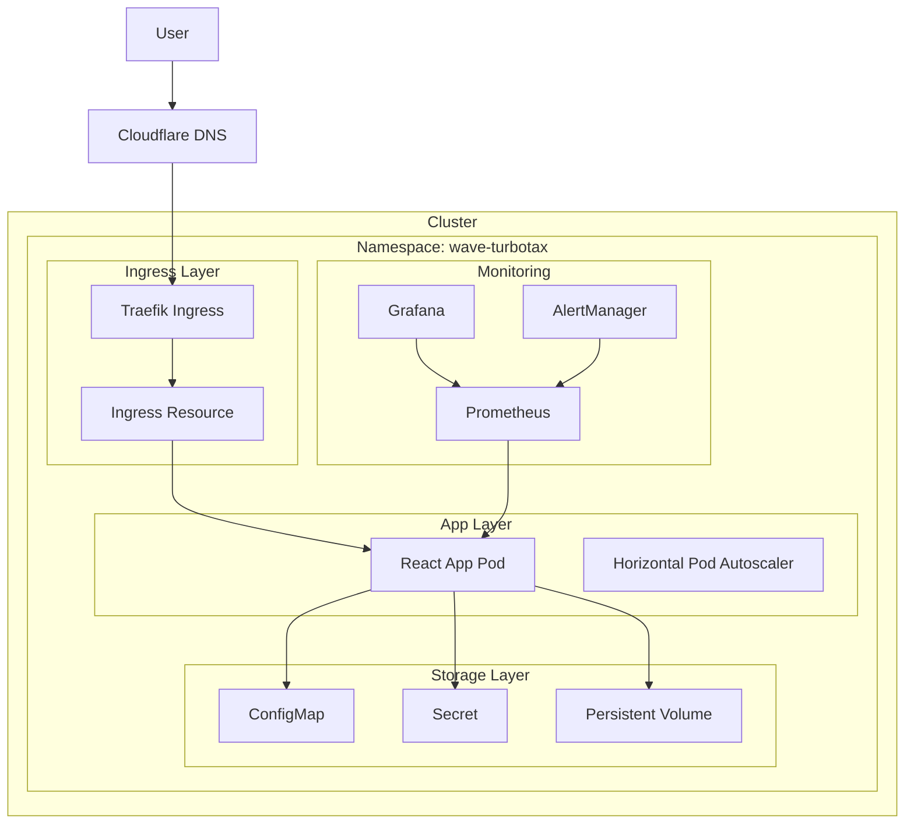

# ☸️ Kubernetes Deployment Guide

**Production-ready Kubernetes manifests** for deploying the Wave-to-TurboTax React application with Traefik, automatic TLS, and scalable infrastructure.

---

## 📋 Table of Contents

1. [🏗️ Architecture Overview](#️-architecture-overview)
2. [📦 Kubernetes Manifests](#-kubernetes-manifests)
3. [🌐 Ingress Configuration](#-ingress-configuration)
4. [📊 Monitoring & Observability](#-monitoring--observability)
5. [🔐 Security & RBAC](#-security--rbac)
6. [🚀 Deployment Strategies](#-deployment-strategies)
7. [📁 ArgoCD GitOps Setup](#-argocd-gitops-setup)
8. [🔧 Scaling & Performance](#-scaling--performance)
9. [🆘 Troubleshooting](#-troubleshooting)

---

## 🏗️ Architecture Overview

### 🌐 Kubernetes Architecture



### 🎯 Components Overview

| Component | Purpose | Replicas | Resources |
|-----------|---------|----------|-----------|
| **React App** | Main application | 2-3 | 100m CPU / 128Mi RAM |
| **Traefik** | Ingress controller | 2 | 200m CPU / 256Mi RAM |
| **Prometheus** | Metrics collection | 1 | 500m CPU / 1Gi RAM |
| **Grafana** | Visualization dashboard | 1 | 200m CPU / 512Mi RAM |
| **AlertManager** | Alert routing | 1 | 100m CPU / 128Mi RAM |

---

## 📦 Kubernetes Manifests

### 🌍 Namespace Configuration

Create `k8s/namespace.yaml`:

```yaml
apiVersion: v1
kind: Namespace
metadata:
  name: wave-turbotax
  labels:
    name: wave-turbotax
    app.kubernetes.io/name: wave-turbotax
    app.kubernetes.io/part-of: wave-turbotax
    
---
apiVersion: v1
kind: ResourceQuota
metadata:
  name: wave-turbotax-quota
  namespace: wave-turbotax
spec:
  hard:
    requests.cpu: "2"
    requests.memory: 4Gi
    limits.cpu: "4"
    limits.memory: 8Gi
    pods: "10"
    services: "5"
    secrets: "10"
    configmaps: "10"
    persistentvolumeclaims: "5"
```

### 🔐 Secrets and ConfigMaps

Create `k8s/secrets.yaml`:

```yaml
apiVersion: v1
kind: Secret
metadata:
  name: wave-turbotax-secrets
  namespace: wave-turbotax
  labels:
    app.kubernetes.io/name: wave-turbotax
    app.kubernetes.io/component: secrets
type: Opaque
data:
  # Base64 encoded values
  APP_VERSION: "Mi4wLjA="  # 2.0.0
  GRAFANA_PASSWORD: YWRtaW4xMjM=  # admin123
  
---
apiVersion: v1
kind: Secret
metadata:
  name: wave-turbotax-tls
  namespace: wave-turbotax
  labels:
    app.kubernetes.io/name: wave-turbotax
    app.kubernetes.io/component: tls
type: kubernetes.io/tls
data:
  tls.crt: LS0tLS1CRUdJTiBDRVJUSUZJQ0FURS0tLS0t...
  tls.key: LS0tLS1CRUdJTiBQUklWQVRFIEtFWS0tLS0t...

---
apiVersion: v1
kind: ConfigMap
metadata:
  name: wave-turbotax-config
  namespace: wave-turbotax
  labels:
    app.kubernetes.io/name: wave-turbotax
    app.kubernetes.io/component: config
data:
  NODE_ENV: "production"
  VITE_APP_URL: "https://tax.yantorno.party"
  VITE_API_URL: "https://api.tax.yantorno.party"
  Nginx.conf: |
    events {
        worker_connections 1024;
    }
    
    http {
        include /etc/nginx/mime.types;
        default_type application/octet-stream;
        
        # Security headers
        add_header X-Frame-Options "SAMEORIGIN" always;
        add_header X-Content-Type-Options "nosniff" always;
        add_header X-XSS-Protection "1; mode=block" always;
        add_header Referrer-Policy "strict-origin-when-cross-origin" always;
        add_header Content-Security-Policy "default-src 'self'; script-src 'self' 'unsafe-inline'; style-src 'self' 'unsafe-inline'; img-src 'self' data: https:; font-src 'self'; connect-src 'self';" always;
        
        # Gzip compression
        gzip on;
        gzip_vary on;
        gzip_min_length 1024;
        gzip_types text/plain text/css text/xml text/javascript application/javascript application/xml+rss application/json;
        
        server {
            listen 8080;
            server_name localhost;
            root /usr/share/nginx/html;
            index index.html;
            
            # Security
            server_tokens off;
            
            # Static asset caching
            location ~* \.(js|css|png|jpg|jpeg|gif|ico|svg|woff|woff2|ttf|eot)$ {
                expires 1y;
                add_header Cache-Control "public, immutable";
                try_files $uri =404;
            }
            
            # SPA routing
            location / {
                try_files $uri $uri/ /index.html;
                expires -1;
                add_header Cache-Control "no-cache, no-store, must-revalidate";
            }
            
            # Health endpoint
            location /health {
                access_log off;
                return 200 "healthy\n";
            }
        }
    }
```

### 🚀 Application Deployment

Create `k8s/deployment.yaml`:

```yaml
apiVersion: apps/v1
kind: Deployment
metadata:
  name: wave-turbotax-app
  namespace: wave-turbotax
  labels:
    app.kubernetes.io/name: wave-turbotax
    app.kubernetes.io/component: app
    app.kubernetes.io/version: "2.0.0"
spec:
  replicas: 3
  strategy:
    type: RollingUpdate
    rollingUpdate:
      maxSurge: 1
      maxUnavailable: 1
  selector:
    matchLabels:
      app.kubernetes.io/name: wave-turbotax
      app.kubernetes.io/component: app
  template:
    metadata:
      labels:
        app.kubernetes.io/name: wave-turbotax
        app.kubernetes.io/component: app
        app.kubernetes.io/version: "2.0.0"
      annotations:
        prometheus.io/scrape: "true"
        prometheus.io/port: "8080"
        prometheus.io/path: "/metrics"
    spec:
      securityContext:
        runAsNonRoot: true
        runAsUser: 1000
        runAsGroup: 3000
        fsGroup: 3000
        seccompProfile:
          type: RuntimeDefault
      containers:
        - name: wave-turbotax-app
          image: ghcr.io/tupacalypse187/wave-turbotax-app:latest
          imagePullPolicy: Always
          ports:
            - name: http
              containerPort: 8080
              protocol: TCP
          env:
            - name: NODE_ENV
              valueFrom:
                configMapKeyRef:
                  name: wave-turbotax-config
                  key: NODE_ENV
            - name: VITE_APP_URL
              valueFrom:
                configMapKeyRef:
                  name: wave-turbotax-config
                  key: VITE_APP_URL
            - name: VITE_API_URL
              valueFrom:
                configMapKeyRef:
                  name: wave-turbotax-config
                  key: VITE_API_URL
            - name: APP_VERSION
              valueFrom:
                secretKeyRef:
                  name: wave-turbotax-secrets
                  key: APP_VERSION
          resources:
            limits:
              cpu: 500m
              memory: 512Mi
            requests:
              cpu: 100m
              memory: 128Mi
          securityContext:
            allowPrivilegeEscalation: false
            readOnlyRootFilesystem: true
            capabilities:
              drop:
                - ALL
          volumeMounts:
            - name: nginx-config
              mountPath: /etc/nginx/conf.d/default.conf
              subPath: Nginx.conf
          livenessProbe:
            httpGet:
              path: /health
              port: http
              scheme: HTTP
            initialDelaySeconds: 30
            periodSeconds: 10
            timeoutSeconds: 5
            successThreshold: 1
            failureThreshold: 3
          readinessProbe:
            httpGet:
              path: /health
              port: http
              scheme: HTTP
            initialDelaySeconds: 5
            periodSeconds: 5
            timeoutSeconds: 3
            successThreshold: 1
            failureThreshold: 3
          lifecycle:
            preStop:
              exec:
                command: ["/bin/sh", "-c", "sleep 15"]
      volumes:
        - name: nginx-config
          configMap:
            name: wave-turbotax-config
      imagePullSecrets:
        - name: ghcr-secret
      nodeSelector:
        kubernetes.io/os: linux
      tolerations:
        - key: "node.kubernetes.io/unreachable"
          operator: "Exists"
          effect: "NoExecute"
          tolerationSeconds: 600
      affinity:
        podAntiAffinity:
          preferredDuringSchedulingIgnoredDuringExecution:
            - weight: 100
              podAffinityTerm:
                labelSelector:
                  matchExpressions:
                    - key: app.kubernetes.io/name
                      operator: In
                      values:
                        - wave-turbotax
                topologyKey: kubernetes.io/hostname

---
apiVersion: v1
kind: Service
metadata:
  name: wave-turbotax-app-service
  namespace: wave-turbotax
  labels:
    app.kubernetes.io/name: wave-turbotax
    app.kubernetes.io/component: app
  annotations:
    prometheus.io/scrape: "true"
    prometheus.io/port: "8080"
    prometheus.io/path: "/metrics"
spec:
  type: ClusterIP
  ports:
    - name: http
      port: 80
      targetPort: http
      protocol: TCP
  selector:
    app.kubernetes.io/name: wave-turbotax
    app.kubernetes.io/component: app

---
apiVersion: policy/v1
kind: PodDisruptionBudget
metadata:
  name: wave-turbotax-app-pdb
  namespace: wave-turbotax
spec:
  minAvailable: 2
  selector:
    matchLabels:
      app.kubernetes.io/name: wave-turbotax
      app.kubernetes.io/component: app

---
apiVersion: autoscaling/v2
kind: HorizontalPodAutoscaler
metadata:
  name: wave-turbotax-app-hpa
  namespace: wave-turbotax
  labels:
    app.kubernetes.io/name: wave-turbotax
    app.kubernetes.io/component: app
spec:
  scaleTargetRef:
    apiVersion: apps/v1
    kind: Deployment
    name: wave-turbotax-app
  minReplicas: 3
  maxReplicas: 10
  metrics:
    - type: Resource
      resource:
        name: cpu
        target:
          type: Utilization
          averageUtilization: 70
    - type: Resource
      resource:
        name: memory
        target:
          type: Utilization
          averageUtilization: 80
  behavior:
    scaleDown:
      stabilizationWindowSeconds: 300
      policies:
        - type: Percent
          value: 10
          periodSeconds: 60
    scaleUp:
      stabilizationWindowSeconds: 60
      policies:
        - type: Percent
          value: 50
          periodSeconds: 60
        - type: Pods
          value: 2
          periodSeconds: 60
      selectPolicy: Max
```

### 🌐 Ingress Configuration

Create `k8s/ingress.yaml`:

```yaml
apiVersion: networking.k8s.io/v1
kind: Ingress
metadata:
  name: wave-turbotax-ingress
  namespace: wave-turbotax
  labels:
    app.kubernetes.io/name: wave-turbotax
    app.kubernetes.io/component: ingress
  annotations:
    # Traefik annotations
    traefik.ingress.kubernetes.io/router.middlewares: "wave-turbotax-headers@kubernetescrd"
    traefik.ingress.kubernetes.io/router.entrypoints: "web,websecure"
    traefik.ingress.kubernetes.io/router.tls: "true"
    traefik.ingress.kubernetes.io/router.tls.certresolver: "letsencrypt"
    
    # Security headers
    traefik.ingress.kubernetes.io/router.middlewares: "wave-turbotax-headers@kubernetescrd,wave-turbotax-ratelimit@kubernetescrd"
    
    # Rate limiting
    traefik.ingress.kubernetes.io/router.middlewares: "wave-turbotax-ratelimit@kubernetescrd"
    
    # Compression
    traefik.ingress.kubernetes.io/router.middlewares: "wave-turbotax-compression@kubernetescrd"
    
    # Custom error pages
    traefik.ingress.kubernetes.io/router.middlewares: "wave-turbotax-errors@kubernetescrd"
spec:
  ingressClassName: "traefik"
  tls:
    - hosts:
        - tax.yantorno.party
        - www.tax.yantorno.party
      secretName: wave-turbotax-tls
  rules:
    - host: "tax.yantorno.party"
      http:
        paths:
          - path: /
            pathType: Prefix
            backend:
              service:
                name: wave-turbotax-app-service
                port:
                  number: 80
    - host: "www.tax.yantorno.party"
      http:
        paths:
          - path: /
            pathType: Prefix
            backend:
              service:
                name: wave-turbotax-app-service
                port:
                  number: 80

---
# Middleware for security headers
apiVersion: traefik.io/v1alpha1
kind: Middleware
metadata:
  name: wave-turbotax-headers
  namespace: wave-turbotax
spec:
  headers:
    frameDeny: true
    contentTypeNosniff: true
    browserXssFilter: true
    referrerPolicy: "strict-origin-when-cross-origin"
    permissionsPolicy:
      geolocation: "none"
      microphone: "none"
      camera: "none"
      payment: "none"
    customRequestHeaders:
      X-Forwarded-Proto: "https"
    customResponseHeaders:
      X-Powered-By: "Wave TurboTax Converter"
      X-Content-Type-Options: "nosniff"

---
# Middleware for rate limiting
apiVersion: traefik.io/v1alpha1
kind: Middleware
metadata:
  name: wave-turbotax-ratelimit
  namespace: wave-turbotax
spec:
  rateLimit:
    average: 100
    period: 1m
    burst: 200

---
# Middleware for compression
apiVersion: traefik.io/v1alpha1
kind: Middleware
metadata:
  name: wave-turbotax-compression
  namespace: wave-turbotax
spec:
  compress:
    excludedContentTypes:
      - text/event-stream

---
# Middleware for error pages
apiVersion: traefik.io/v1alpha1
kind: Middleware
metadata:
  name: wave-turbotax-errors
  namespace: wave-turbotax
spec:
  errors:
    status:
      - "400-599"
    service:
      name: wave-turbotax-app-service
      port: 80
    query: "/{status}.html"
```

### 📊 Monitoring Stack

Create `k8s/monitoring.yaml`:

```yaml
# Prometheus
apiVersion: apps/v1
kind: Deployment
metadata:
  name: prometheus
  namespace: wave-turbotax
  labels:
    app.kubernetes.io/name: prometheus
    app.kubernetes.io/component: monitoring
spec:
  replicas: 1
  selector:
    matchLabels:
      app.kubernetes.io/name: prometheus
      app.kubernetes.io/component: monitoring
  template:
    metadata:
      labels:
        app.kubernetes.io/name: prometheus
        app.kubernetes.io/component: monitoring
    spec:
      containers:
        - name: prometheus
          image: prom/prometheus:latest
          ports:
            - containerPort: 9090
          args:
            - '--config.file=/etc/prometheus/prometheus.yml'
            - '--storage.tsdb.path=/prometheus/'
            - '--web.console.libraries=/etc/prometheus/console_libraries'
            - '--web.console.templates=/etc/prometheus/consoles'
            - '--storage.tsdb.retention.time=30d'
            - '--web.enable-lifecycle'
          volumeMounts:
            - name: prometheus-config
              mountPath: /etc/prometheus/
            - name: prometheus-storage
              mountPath: /prometheus/
          resources:
            limits:
              cpu: 500m
              memory: 1Gi
            requests:
              cpu: 200m
              memory: 512Mi
      volumes:
        - name: prometheus-config
          configMap:
            name: prometheus-config
        - name: prometheus-storage
          persistentVolumeClaim:
            claimName: prometheus-pvc

---
apiVersion: v1
kind: Service
metadata:
  name: prometheus-service
  namespace: wave-turbotax
  labels:
    app.kubernetes.io/name: prometheus
    app.kubernetes.io/component: monitoring
spec:
  type: ClusterIP
  ports:
    - port: 9090
      targetPort: 9090
  selector:
    app.kubernetes.io/name: prometheus
    app.kubernetes.io/component: monitoring

---
apiVersion: v1
kind: PersistentVolumeClaim
metadata:
  name: prometheus-pvc
  namespace: wave-turbotax
spec:
  accessModes:
    - ReadWriteOnce
  resources:
    requests:
      storage: 20Gi
  storageClassName: fast-ssd

---
# Grafana
apiVersion: apps/v1
kind: Deployment
metadata:
  name: grafana
  namespace: wave-turbotax
  labels:
    app.kubernetes.io/name: grafana
    app.kubernetes.io/component: monitoring
spec:
  replicas: 1
  selector:
    matchLabels:
      app.kubernetes.io/name: grafana
      app.kubernetes.io/component: monitoring
  template:
    metadata:
      labels:
        app.kubernetes.io/name: grafana
        app.kubernetes.io/component: monitoring
    spec:
      containers:
        - name: grafana
          image: grafana/grafana:latest
          ports:
            - containerPort: 3000
          env:
            - name: GF_SECURITY_ADMIN_PASSWORD
              valueFrom:
                secretKeyRef:
                  name: wave-turbotax-secrets
                  key: GRAFANA_PASSWORD
            - name: GF_USERS_ALLOW_SIGN_UP
              value: "false"
            - name: GF_SERVER_DOMAIN
              value: "tax.yantorno.party"
            - name: GF_SERVER_ROOT_URL
              value: "https://tax.yantorno.party/grafana/"
          volumeMounts:
            - name: grafana-storage
              mountPath: /var/lib/grafana
          resources:
            limits:
              cpu: 200m
              memory: 512Mi
            requests:
              cpu: 100m
              memory: 256Mi
      volumes:
        - name: grafana-storage
          persistentVolumeClaim:
            claimName: grafana-pvc

---
apiVersion: v1
kind: Service
metadata:
  name: grafana-service
  namespace: wave-turbotax
  labels:
    app.kubernetes.io/name: grafana
    app.kubernetes.io/component: monitoring
spec:
  type: ClusterIP
  ports:
    - port: 3000
      targetPort: 3000
  selector:
    app.kubernetes.io/name: grafana
    app.kubernetes.io/component: monitoring

---
apiVersion: v1
kind: PersistentVolumeClaim
metadata:
  name: grafana-pvc
  namespace: wave-turbotax
spec:
  accessModes:
    - ReadWriteOnce
  resources:
    requests:
      storage: 10Gi
  storageClassName: fast-ssd

---
# Prometheus Config
apiVersion: v1
kind: ConfigMap
metadata:
  name: prometheus-config
  namespace: wave-turbotax
data:
  prometheus.yml: |
    global:
      scrape_interval: 15s
      evaluation_interval: 15s
    
    rule_files:
      - "wave_turbotax_rules.yml"
    
    alerting:
      alertmanagers:
        - static_configs:
            - targets:
              - alertmanager:9093
    
    scrape_configs:
      - job_name: 'traefik'
        static_configs:
          - targets: ['traefik:8080']
        metrics_path: /metrics
        scrape_interval: 30s
      
      - job_name: 'wave-turbotax-app'
        kubernetes_sd_configs:
          - role: pod
            namespaces:
              names:
                - wave-turbotax
        relabel_configs:
          - source_labels: [__meta_kubernetes_pod_label_app_kubernetes_io_name]
            action: keep
            regex: wave-turbotax
          - source_labels: [__meta_kubernetes_pod_annotation_prometheus_io_scrape]
            action: keep
            regex: true
          - source_labels: [__meta_kubernetes_pod_annotation_prometheus_io_path]
            action: replace
            target_label: __metrics_path__
            regex: (.+)
          - source_labels: [__address__, __meta_kubernetes_pod_annotation_prometheus_io_port]
            action: replace
            regex: ([^:]+)(?::\d+)?;(\d+)
            replacement: $1:$2
            target_label: __address__
        scrape_interval: 30s
      
      - job_name: 'kubernetes-nodes'
        kubernetes_sd_configs:
          - role: node
        relabel_configs:
          - action: labelmap
            regex: __meta_kubernetes_node_label_(.+)
        scrape_interval: 30s

  wave_turbotax_rules.yml: |
    groups:
      - name: wave_turbotax.rules
        rules:
          - alert: WaveTurboTaxAppDown
            expr: up{job="wave-turbotax-app"} == 0
            for: 1m
            labels:
              severity: critical
            annotations:
              summary: "Wave TurboTax app is down"
              description: "Wave TurboTax app has been down for more than 1 minute."
          
          - alert: HighResponseTime
            expr: http_request_duration_seconds{quantile="0.95"} > 2
            for: 5m
            labels:
              severity: warning
            annotations:
              summary: "High response time detected"
              description: "95th percentile response time is above 2 seconds."
          
          - alert: HighErrorRate
            expr: rate(http_requests_total{status=~"5.."}[5m]) > 0.1
            for: 5m
            labels:
              severity: critical
            annotations:
              summary: "High error rate detected"
              description: "Error rate is above 10% for more than 5 minutes."
          
          - alert: HighMemoryUsage
            expr: container_memory_usage_bytes / container_spec_memory_limit_bytes > 0.9
            for: 5m
            labels:
              severity: warning
            annotations:
              summary: "High memory usage"
              description: "Memory usage is above 90% of limit."
          
          - alert: HighCPUUsage
            expr: rate(container_cpu_usage_seconds_total[5m]) > 0.8
            for: 5m
            labels:
              severity: warning
            annotations:
              summary: "High CPU usage"
              description: "CPU usage is above 80% for more than 5 minutes."
```

---

## 🌐 Ingress Configuration

### 🔄 Traefik Deployment

Create `k8s/traefik.yaml`:

```yaml
apiVersion: apps/v1
kind: Deployment
metadata:
  name: traefik
  namespace: wave-turbotax
  labels:
    app.kubernetes.io/name: traefik
    app.kubernetes.io/component: ingress
spec:
  replicas: 2
  strategy:
    type: RollingUpdate
    rollingUpdate:
      maxSurge: 1
      maxUnavailable: 0
  selector:
    matchLabels:
      app.kubernetes.io/name: traefik
      app.kubernetes.io/component: ingress
  template:
    metadata:
      labels:
        app.kubernetes.io/name: traefik
        app.kubernetes.io/component: ingress
      annotations:
        prometheus.io/scrape: "true"
        prometheus.io/port: "8080"
        prometheus.io/path: "/metrics"
    spec:
      serviceAccountName: traefik
      containers:
        - name: traefik
          image: traefik:v2.10
          args:
            - "--api.dashboard=true"
            - "--api.insecure=false"
            - "--providers.kubernetesingress=true"
            - "--providers.kubernetescrd=true"
            - "--entrypoints.web.address=:80"
            - "--entrypoints.websecure.address=:443"
            - "--entrypoints.web.http.redirections.entrypoint.to=websecure"
            - "--entrypoints.web.http.redirections.entrypoint.scheme=https"
            - "--certificatesresolvers.letsencrypt.acme.tlschallenge=true"
            - "--certificatesresolvers.letsencrypt.acme.email=admin@yantorno.party"
            - "--certificatesresolvers.letsencrypt.acme.storage=/acme.json"
            - "--global.checknewversion=false"
            - "--global.sendanonymoususage=false"
            - "--ping=true"
            - "--metrics.prometheus=true"
            - "--metrics.prometheus.addentrypointslabels=true"
            - "--metrics.prometheus.addserviceslabels=true"
            - "--tracing.jaeger=true"
            - "--tracing.jaeger.samplingServerURL=http://jaeger:14268/api/sampling"
            - "--accesslog=true"
            - "--accesslog.filepath=/var/log/traefik/access.log"
            - "--log.level=INFO"
          ports:
            - name: web
              containerPort: 80
              protocol: TCP
            - name: websecure
              containerPort: 443
              protocol: TCP
            - name: metrics
              containerPort: 8080
              protocol: TCP
          securityContext:
            capabilities:
              drop:
                - ALL
              add:
                - NET_BIND_SERVICE
          volumeMounts:
            - name: acme-storage
              mountPath: /acme.json
              subPath: acme.json
            - name: logs
              mountPath: /var/log/traefik
          resources:
            limits:
              cpu: 500m
              memory: 512Mi
            requests:
              cpu: 200m
              memory: 256Mi
          livenessProbe:
            httpGet:
              path: /ping
              port: 8080
              scheme: HTTP
            initialDelaySeconds: 10
            periodSeconds: 10
            timeoutSeconds: 5
            successThreshold: 1
            failureThreshold: 3
          readinessProbe:
            httpGet:
              path: /ping
              port: 8080
              scheme: HTTP
            initialDelaySeconds: 5
            periodSeconds: 5
            timeoutSeconds: 3
            successThreshold: 1
            failureThreshold: 3
      volumes:
        - name: acme-storage
          secret:
            secretName: traefik-acme
        - name: logs
          emptyDir: {}
      nodeSelector:
        kubernetes.io/os: linux

---
apiVersion: v1
kind: Service
metadata:
  name: traefik
  namespace: wave-turbotax
  labels:
    app.kubernetes.io/name: traefik
    app.kubernetes.io/component: ingress
  annotations:
    prometheus.io/scrape: "true"
    prometheus.io/port: "8080"
    prometheus.io/path: "/metrics"
spec:
  type: LoadBalancer
  selector:
    app.kubernetes.io/name: traefik
    app.kubernetes.io/component: ingress
  ports:
    - name: web
      port: 80
      targetPort: web
      protocol: TCP
    - name: websecure
      port: 443
      targetPort: websecure
      protocol: TCP
    - name: metrics
      port: 8080
      targetPort: metrics
      protocol: TCP

---
apiVersion: v1
kind: ServiceAccount
metadata:
  name: traefik
  namespace: wave-turbotax

---
apiVersion: rbac.authorization.k8s.io/v1
kind: ClusterRole
metadata:
  name: traefik-role
rules:
  - apiGroups:
      - ""
    resources:
      - services
      - endpoints
      - secrets
    verbs:
      - get
      - list
      - watch
  - apiGroups:
      - extensions
      - networking.k8s.io
    resources:
      - ingresses
      - ingressclasses
    verbs:
      - get
      - list
      - watch
  - apiGroups:
      - extensions
      - networking.k8s.io
    resources:
      - ingresses/status
    verbs:
      - update

---
apiVersion: rbac.authorization.k8s.io/v1
kind: ClusterRoleBinding
metadata:
  name: traefik-role-binding
roleRef:
  apiGroup: rbac.authorization.k8s.io
  kind: ClusterRole
  name: traefik-role
subjects:
  - kind: ServiceAccount
    name: traefik
    namespace: wave-turbotax

---
apiVersion: traefik.io/v1alpha1
kind: IngressRoute
metadata:
  name: traefik-dashboard
  namespace: wave-turbotax
spec:
  entryPoints:
    - websecure
  routes:
    - match: Host(`traefik.tax.yantorno.party`) && (PathPrefix(`/dashboard`) || PathPrefix(`/api`))
      kind: Rule
      services:
        - name: api@internal
          kind: TraefikService
      middlewares:
        - name: traefik-auth
  tls:
    certResolver: letsencrypt

---
apiVersion: traefik.io/v1alpha1
kind: Middleware
metadata:
  name: traefik-auth
  namespace: wave-turbotax
spec:
  basicAuth:
    secret: traefik-auth

---
apiVersion: v1
kind: Secret
metadata:
  name: traefik-auth
  namespace: wave-turbotax
data:
  users: |2
    admin:$apr1$LymM3L2P$BqN5s2VK/RKfQsIjM2Qxu1  # admin:admin123

---
apiVersion: v1
kind: Secret
metadata:
  name: traefik-acme
  namespace: wave-turbotax
data:
  acme.json: e30=  # Empty JSON object

---
apiVersion: networking.k8s.io/v1
kind: Ingress
metadata:
  name: traefik-dashboard
  namespace: wave-turbotax
  annotations:
    traefik.ingress.kubernetes.io/router.middlewares: "wave-turbotax-traefik-auth@kubernetescrd"
spec:
  ingressClassName: "traefik"
  tls:
    - hosts:
        - traefik.tax.yantorno.party
      secretName: traefik-dashboard-tls
  rules:
    - host: "traefik.tax.yantorno.party"
      http:
        paths:
          - path: /
            pathType: Prefix
            backend:
              service:
                name: traefik
                port:
                  number: 8080
```

---

## 📁 ArgoCD GitOps Setup

### 🚀 ArgoCD Application

Create `argocd/application.yaml`:

```yaml
apiVersion: argoproj.io/v1alpha1
kind: Application
metadata:
  name: wave-turbotax
  namespace: argocd
  finalizers:
    - resources-finalizer.argocd.argoproj.io
spec:
  project: default
  source:
    repoURL: https://github.com/tupacalypse187/wave-turbotax-import.git
    targetRevision: main
    path: k8s
    directory:
      recurse: true
  destination:
    server: https://kubernetes.default.svc
    namespace: wave-turbotax
  syncPolicy:
    automated:
      prune: true
      selfHeal: true
      allowEmpty: false
    syncOptions:
      - CreateNamespace=true
      - PrunePropagationPolicy=foreground
      - PruneLast=true
      - RespectIgnoreDifferences=true
    retry:
      limit: 5
      backoff:
        duration: 5s
        factor: 2
        maxDuration: 3m
  revisionHistoryLimit: 10

---
apiVersion: argoproj.io/v1alpha1
kind: AppProject
metadata:
  name: wave-turbotax
  namespace: argocd
spec:
  description: Wave TurboTax Converter Project
  sourceRepos:
    - https://github.com/tupacalypse187/wave-turbotax-import.git
  destinations:
    - namespace: wave-turbotax
      server: https://kubernetes.default.svc
    - namespace: argocd
      server: https://kubernetes.default.svc
  clusterResourceWhitelist:
    - group: rbac.authorization.k8s.io
      kind: ClusterRole
    - group: rbac.authorization.k8s.io
      kind: ClusterRoleBinding
  namespaceResourceBlacklist:
    - group: ''
      kind: PersistentVolume
  roles:
    - name: readonly
      description: Read-only access to the project
      policies:
        - p, proj:wave-turbotax:readonly, applications, get, wave-turbotax/*, allow
        - p, proj:wave-turbotax:readonly, applications, list, wave-turbotax/*, allow
        - p, proj:wave-turbotax:readonly, applications, sync, wave-turbotax/*, deny
      groups:
        - argocd-viewers
```

### 🔧 ArgoCD Installation

```yaml
# argocd-install.yaml
apiVersion: v1
kind: Namespace
metadata:
  name: argocd

---
apiVersion: argoproj.io/v1alpha1
kind: Application
metadata:
  name: argocd
  namespace: argocd
spec:
  project: default
  source:
    repoURL: https://github.com/argoproj/argo-cd.git
    targetRevision: v2.8.0
    path: manifests/install
  destination:
    server: https://kubernetes.default.svc
    namespace: argocd
  syncPolicy:
    automated:
      prune: true
      selfHeal: true
```

---

## 🚀 Deployment Commands

### 📦 Deploy to Kubernetes

```bash
# Create namespace
kubectl create namespace wave-turbotax

# Apply secrets first
kubectl apply -f k8s/secrets.yaml

# Apply configuration
kubectl apply -f k8s/namespace.yaml
kubectl apply -f k8s/deployment.yaml
kubectl apply -f k8s/ingress.yaml
kubectl apply -f k8s/monitoring.yaml
kubectl apply -f k8s/traefik.yaml

# Check deployment status
kubectl get pods -n wave-turbotax
kubectl get services -n wave-turbotax
kubectl get ingress -n wave-turbotax

# Check logs
kubectl logs -f deployment/wave-turbotax-app -n wave-turbotax
kubectl logs -f deployment/traefik -n wave-turbotax
```

### 🔍 Monitoring Commands

```bash
# Check pod resources
kubectl top pods -n wave-turbotax

# Check HPA status
kubectl get hpa -n wave-turbotax

# Check events
kubectl get events -n wave-turbotax --sort-by='.lastTimestamp'

# Port forward for debugging
kubectl port-forward svc/grafana-service 3000:3000 -n wave-turbotax
kubectl port-forward svc/prometheus-service 9090:9090 -n wave-turbotax
```

---

## 🆘 Troubleshooting

### 🔧 Common Issues

| Issue | Diagnosis | Solution |
|-------|------------|----------|
| **Pod stuck in CrashLoopBackOff** | `kubectl logs podname -n wave-turbotax` | Check image pull, resource limits, environment variables |
| **Ingress not working** | `kubectl describe ingress -n wave-turbotax` | Verify DNS, TLS certs, Traefik logs |
| **HPA not scaling** | `kubectl get hpa -n wave-turbotax` | Check metrics server, resource requests/limits |
| **SSL certificate errors** | `kubectl describe cert` | Verify Let's Encrypt rate limits, DNS records |
| **High memory usage** | `kubectl top pods -n wave-turbotax` | Adjust resource limits, add more nodes |

### 📊 Health Checks

```bash
# Application health
curl -f https://tax.yantorno.party/health

# Ingress health
kubectl get ingress wave-turbotax-ingress -n wave-turbotax -o yaml

# Service connectivity
kubectl exec -it deployment/wave-turbotax-app -n wave-turbotax -- curl http://localhost:8080/health

# DNS resolution
nslookup tax.yantorno.party
dig tax.yantorno.party
```

---

<div align="center">
  <p>🚀 Your Wave TurboTax app is now running on Kubernetes!</p>
  <p>🌐 Access at: <a href="https://tax.yantorno.party">https://tax.yantorno.party</a></p>
  <p>📊 Monitoring: <a href="https://traefik.tax.yantorno.party">Traefik Dashboard</a></p>
</div>