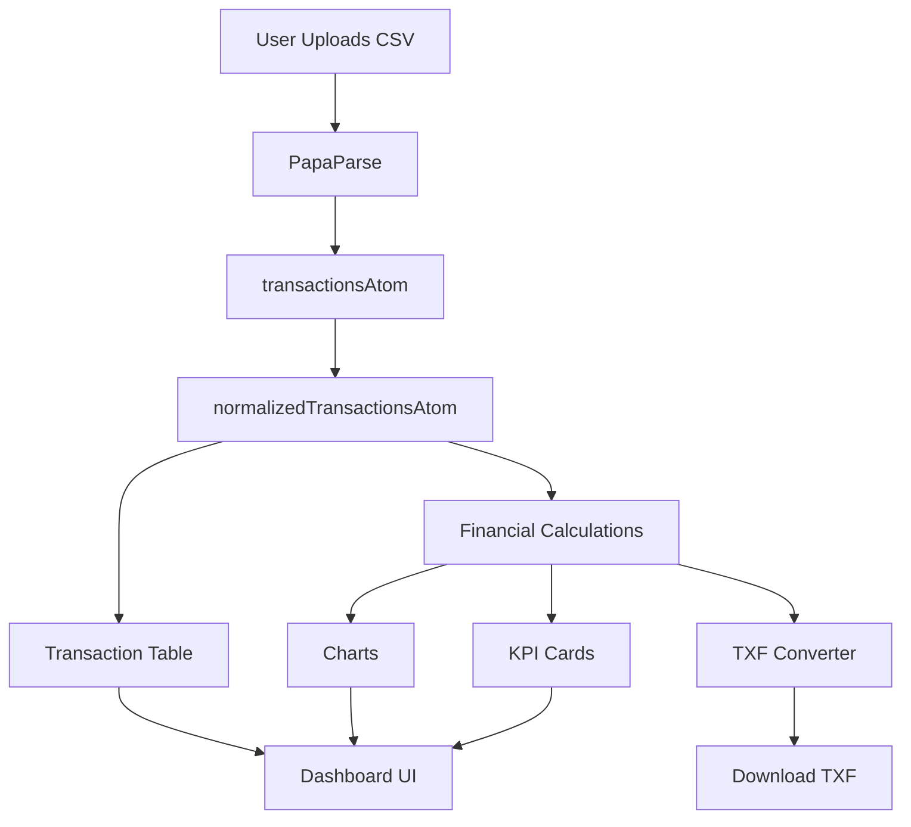

# 🌊 Wave → TurboTax Converter | React Dashboard
**Version:** 2.0.0 | **Modern React Application**

[](https://www.typescriptlang.org/)
[](https://reactjs.org/)
[](https://vitejs.dev/)
[](https://tailwindcss.com/)

## 🎯 Overview

A **modern, interactive React application** that converts Wave Accounting CSV exports to TurboTax TXF format with beautiful visualizations and a comprehensive financial dashboard. Built with privacy-first architecture - **all processing happens client-side**.

### ✨ Key Features

#### 🔄 Data Conversion
- **Drag-and-drop CSV upload** with instant validation
- **Wave Accounting compatibility** with automatic column mapping
- **TXF format generation** for TurboTax import
- **Smart duplicate filtering** removes "Owner Investment / Drawings"

#### 📊 Interactive Dashboard
- **6 KPI Cards**: Income, Expenses, Net Income, Transactions, TXF-Ready, Top Expense
- **Real-time Charts**:
  - 📈 Income vs Expenses trend (monthly)
  - 🥧 Expense distribution pie chart (clickable categories)
  - 📊 Operating expenses bar chart (horizontal)
- **Click-to-filter** functionality on all charts
- **Transaction Table** with search, pagination, and category filtering

#### 🎨 Modern UI/UX
- **Glassmorphism design** with gradient backgrounds
- **Responsive layout** works on all devices
- **Smooth animations** and hover effects
- **Dark theme** with purple/blue accents
- **Tab navigation** between Converter and Dashboard

#### 🔐 Privacy & Security
- **100% client-side processing** - no server uploads
- **No data retention** - transactions cleared on refresh
- **Local file handling** with secure parsing
- **Open source** and fully auditable code

## 🛠️ Technology Stack

| Technology | Purpose | Version |
|------------|---------|---------|
| **React 18** | Frontend Framework | 18.3.1 |
| **TypeScript** | Type Safety | 5.6.2 |
| **Vite** | Build Tool & Dev Server | 6.0.1 |
| **Tailwind CSS** | Styling Framework | 4.1.18 |
| **Jotai** | State Management | 2.10.1 |
| **Recharts** | Data Visualization | 3.6.0 |
| **PapaParse** | CSV Parsing | 5.4.1 |

## 📁 Project Structure

```
src/
├── components/
│   ├── ui/
│   │   └── Card.tsx                 # Reusable card component
│   ├── dashboard/
│   │   ├── KPICards.tsx             # 6 KPI metric cards
│   │   ├── IncomeExpenseChart.tsx   # Monthly line chart
│   │   ├── ExpensePieChart.tsx      # Category pie chart
│   │   └── ExpenseSummary.tsx       # Horizontal bar chart
│   ├── FileUpload.tsx               # CSV upload component
│   └── DataPreview.tsx              # Table preview + TXF export
├── pages/
│   ├── Converter.tsx                 # Converter view
│   ├── ClientDashboard.tsx          # Dashboard view
│   └── TransactionTable.tsx         # Data table component
├── lib/
│   └── financialUtils.ts            # Financial calculations
├── store/
│   └── index.ts                     # Jotai state management
├── types/
│   └── index.ts                     # TypeScript interfaces
├── utils/
│   └── txfConverter.ts              # TXF file generation
├── App.tsx                          # Main application
├── main.tsx                         # Entry point
└── index.css                        # Global styles
```

## 🚀 Quick Start

### 📋 Prerequisites
- **Node.js 18+** 
- **npm** or **yarn**

### ⚡ Installation & Development

1. **Clone Repository**
   ```bash
   git clone https://github.com/tupacalypse187/wave-turbotax-import.git
   cd wave-turbotax-import
   ```

2. **Install Dependencies**
   ```bash
   npm install
   ```

3. **Start Development Server**
   ```bash
   npm run dev
   ```
   
4. **Open Browser**: 🌐 [http://localhost:5173](http://localhost:5173)

### 🔨 Build for Production
```bash
npm run build
npm run preview
```

## 📊 Data Flow Architecture



## 📋 CSV Format Requirements

Your Wave Accounting CSV export should include these columns:

| Column | Required | Wave Column Name | Description |
|--------|----------|------------------|-------------|
| Transaction Date | ✅ Yes | `Transaction Date` | Date format flexible |
| Amount | ✅ Yes | `Amount (One column)` | Positive/negative numbers |
| Account Name | ✅ Yes | `Account Name` | Category for mapping |
| Description | ❌ No | `Description` | Optional memo field |

### 📄 Example CSV Format
```csv
Transaction Date,Amount (One column),Account Name,Description
2025-01-15,-252.11,Computer - Hosting,Google Workspace
2025-01-18,-100.00,Software,GitHub Copilot
2025-01-20,5000.00,Service Income,Client consulting
2025-01-22,-45.99,Meals,Client lunch meeting
```

## 🗂️ Category Mapping System

The app automatically maps **58+ Wave categories** to TurboTax Schedule C tax lines:

### 💰 Income Categories (TXF Code 266)
- Sales, Service Income, Consulting Income
- Revenue, Gross Receipts, Uncategorized Income

### 💸 Expense Categories (Schedule C)

| Category | TXF Code | Wave Examples |
|----------|----------|---------------|
| Advertising & Promotion | 271 | Marketing, Web Hosting |
| Car & Truck | 270 | Vehicle Expenses, Gas & Fuel |
| Contractors | 367 | Subcontractors, Contract Labor |
| Insurance | 275 | Business Insurance, Liability |
| Interest | 276 | Credit Card Interest |
| Legal & Professional | 277 | Legal Fees, Accounting Fees |
| Office Expenses | 278 | Software, Computer Hardware/Software |
| Rent | 281 | Office Rent |
| Equipment Rental | 280 | Equipment Rental |
| Repairs | 282 | Repairs & Maintenance |
| Taxes & Licenses | 286 | State Taxes, Permits |
| Travel | 283 | Airfare, Hotel, Taxi |
| Meals | 284 | Client Meals (50% limit) |
| Utilities | 287 | Internet, Telephone, Mobile |
| Other Expenses | 298 | Dues, Education, Bank Fees |

> **Note**: Unmapped categories are automatically skipped during TXF conversion.

## 🎯 Usage Guide

### 📤 Converting CSV to TXF

1. **Upload File**
   - Drag & drop CSV onto upload area
   - Or click to browse files

2. **Preview Data**
   - Review first 10 transactions
   - Verify column mapping
   - Check for errors

3. **Generate TXF**
   - Click "Convert to TXF" 
   - Download automatically starts
   - File named `wave-turbotax-export.txf`

4. **Import to TurboTax**
   - Open TurboTax Desktop
   - File → Import → From Accounting Software
   - Select "Other Financial Software (TXF)"
   - Choose downloaded file

### 📈 Using the Dashboard

1. **Load Data** - Upload CSV first in Converter tab
2. **View KPIs** - Check financial health metrics
3. **Explore Charts**:
   - **Click pie slices** to filter by category
   - **Hover charts** for detailed tooltips
   - **Use transaction table** for search/filter
4. **Analyze Trends** - Track income vs expenses over time

## 🔧 Development Guide

### ➕ Adding New Categories

1. **Update TXF Mapping** in `src/utils/txfConverter.ts`:
   ```typescript
   TXF_MAPPING["Your Category"] = 278  // Use appropriate TXF code
   ```

2. **Optional**: Update `CATEGORY_MAPPING` in `src/lib/financialUtils.ts`

### 📊 Adding New Charts

1. **Create Component** in `src/components/dashboard/`
2. **Use Data Atoms**: `normalizedTransactionsAtom`
3. **Import Utilities**: From `financialUtils.ts`
4. **Register** in `src/pages/ClientDashboard.tsx`

### 🎨 Customizing Styling

- **Tailwind Config**: `tailwind.config.js`
- **Global Styles**: `src/index.css`
- **Component Styles**: CSS Modules in `src/App.css`

### 🧪 Running Tests

```bash
npm run lint      # ESLint checking
npm run typecheck # TypeScript verification
npm run build     # Production build test
```

## 🐳 Docker Deployment

### Basic Dockerfile
```dockerfile
FROM node:18-alpine AS builder
WORKDIR /app
COPY package*.json ./
RUN npm ci
COPY . .
RUN npm run build

FROM nginx:alpine
COPY --from=builder /app/dist /usr/share/nginx/html
COPY nginx.conf /etc/nginx/nginx.conf
EXPOSE 80
CMD ["nginx", "-g", "daemon off;"]
```

### Docker Compose
```yaml
version: '3.8'
services:
  app:
    build: .
    ports:
      - "80:80"
    environment:
      - NODE_ENV=production
```

📖 **See `DEPLOYMENT.md`** for comprehensive production deployment guides.

## 🚀 Production Deployment

### 🌐 Domain Configuration
- **Primary Domain**: `tax.yantorno.party`
- **Automatic TLS** via Caddy + Let's Encrypt
- **Container Orchestration**: Docker Compose / Kubernetes

### 🔧 Deployment Options
1. **Docker Compose** - Simple single-server deployment
2. **MicroK8s + Traefik** - Kubernetes for scale
3. **GitHub Actions** - Automated CI/CD pipeline

📖 **See `DEPLOYMENT.md`**, `KUBERNETES.md`, and `DOCKER.md` for detailed guides.

## 🔒 Security & Privacy

- ✅ **Client-side processing** - No server uploads
- ✅ **No data persistence** - Clear on refresh
- ✅ **Secure file handling** - Local parsing only
- ✅ **HTTPS enforced** - TLS encryption in production
- ✅ **No third-party tracking** - Privacy by design

## 🛠️ Troubleshooting

### 🔧 Common Issues

| Issue | Solution |
|-------|----------|
| **Dependencies won't install** | Delete `node_modules` and `package-lock.json`, run `npm install` |
| **Charts not rendering** | Check browser console, verify data in `normalizedTransactionsAtom` |
| **TXF import fails** | Ensure CSV has mapped categories, check TXF format (V041) |
| **Styles not applying** | Restart dev server, verify Tailwind imports |
| **CSV parsing error** | Check column headers match expected Wave format |

### 🧪 Debug Mode

Enable debug logging in browser console:
```javascript
localStorage.setItem('debug', 'wave-app:*')
```

## 🗺️ Roadmap & Future Enhancements

- [ ] **Multi-currency support** for international businesses
- [ ] **Custom category mapping** UI for user preferences
- [ ] **Excel/CSV export** from dashboard
- [ ] **Year-over-year comparison** charts
- [ ] **Budget tracking** and variance analysis
- [ ] **Receipt upload** and attachment system
- [ ] **Tax year filtering** and archiving
- [ ] **Mobile app** for on-the-go expense tracking
- [ ] **QuickBooks integration** for broader compatibility
- [ ] **API endpoints** for automated workflows

## 📄 License

MIT License - feel free to use, modify, and distribute.

## 🤝 Contributing

1. **Fork** the repository
2. **Create** feature branch (`git checkout -b feature/amazing-feature`)
3. **Commit** changes (`git commit -m 'Add amazing feature'`)
4. **Push** to branch (`git push origin feature/amazing-feature`)
5. **Open** Pull Request

## 📞 Support & Community

- 🐛 **Bug Reports**: [GitHub Issues](https://github.com/tupacalypse187/wave-turbotax-import/issues)
- 💡 **Feature Requests**: [GitHub Discussions](https://github.com/tupacalypse187/wave-turbotax-import/discussions)
- 📧 **Security Issues**: Private message to maintainers

---

<div align="center">
  <p>🌊 Made with ❤️ for small business owners and accountants</p>
  <p>⚡ Lightning-fast • 🔒 Privacy-first • 🎨 Beautiful design</p>
</div>